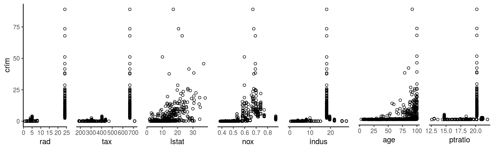
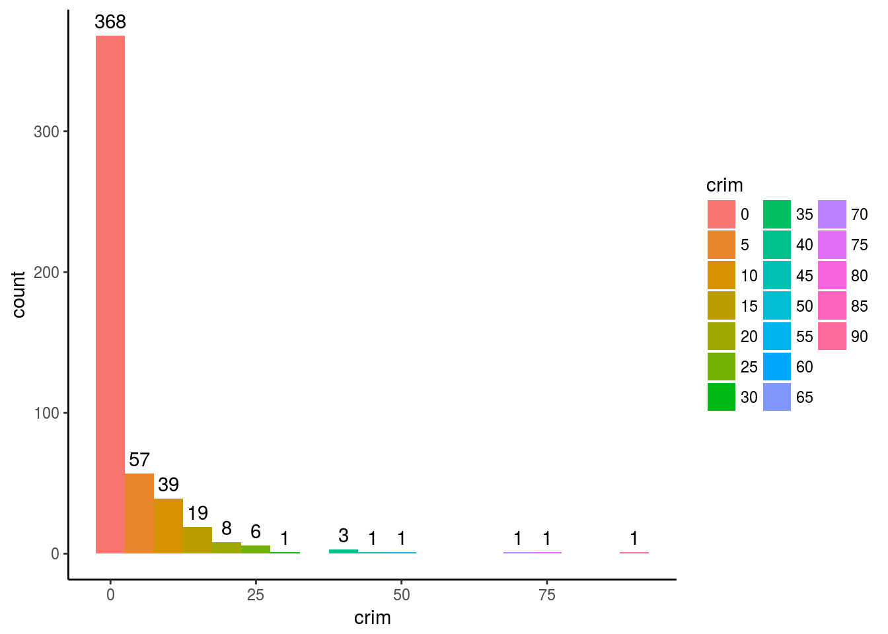
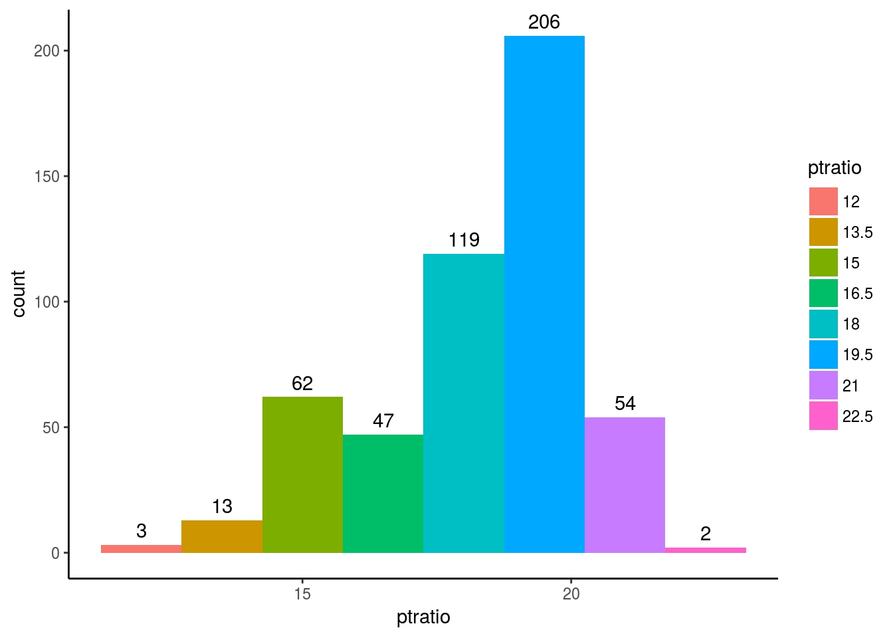
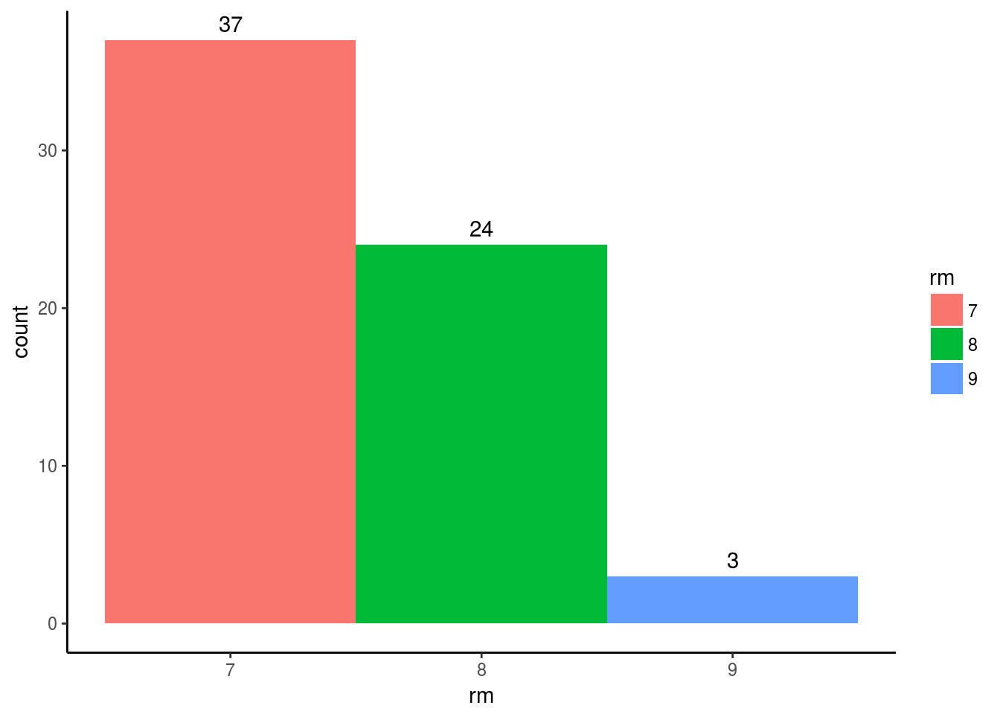

<h1>
  ISLR Ch2 Exercises: #1, #2, #4, #10
</h1>

<h3>
  1. For each of parts (a) through (d), indicate whether we would generally expect the performance of a flexible statistical learning method to be better or worse than an inflexible method. Justify your answer. 
</h3>

<h4> 
  (a) The sample size `n` is extremely large, and the number of predictors `p` is small.
</h4>

> Because of the abundance of data `n` the flexible method will perform better than the inflexible method.  This is because the inflexible method will be highly squewed by any outliers in the small sample which won't affect the inflexible model nearly as much.

<h4> 
  (b) The number of predictors `p` is extremely large, and the number of observations `n` is small.
</h4>

> Because of the large number of predictors `p` the inflexible method will perform better than the inflexible method.  This is because with so many predictors the flexible method will overfit on the small observations `n`.

<h4>
  (c) The relationship between the predictors and response is highly non-linear.
</h4>

> Because the flexible metod has more degrees of freedom than the inflexible method you can generally expect it to out perform the inflexible method.

<h4>
  (d) The variance of the error terms, i.e. $\sigma^2$ = `Var( )`, is extremely high.
</h4>

> Since the $\sigma^2$ is so high the inflexible method will outperform the flexible method because it will mimic the large variance and increase the variance in the results that it predicts as well.

<h3>
  2. Explain whether each scenario is a `classification` or `regression` problem, and indicate whether we are most interested in `inference` or `prediction`. Finally, provide `n` and `p`
</h3>

<h4>
  (a) We collect a set of data on the top `500` firms in the US. For each firm we record `profit`, `number of employees`, `industry` and the `CEO salary`. We are interested in understanding which factors affect `CEO salary`. 
</h4>

This is a `regression` model.  We are trying to `inference` `CEO salary`.


```r
n <- 500
p <- 3
```

P<sub>1</sub> = `profit`, numeric

P<sub>2</sub> = `number of employees`, numeric

P<sub>3</sub> = `industry`, categorical

<h4> 
  (b) We are considering launching a new product and wish to know whether it will be a `success` or a `failure`. We collect data on `20` similar products that were previously launched. For each product we have recorded whether it was a `success` or `failure`, `price charged for the product`, `marketing budget`, `competition price`, and `ten other variables`.
</h4>

Since the outcome of our model is a `success = (1)` or a `failure = (0)` we need to use a `classification` model that tells us either `success` or `failure` in order to make a `prediction` on how our product launch will go.


```r
n <- 20
p <- 13
```

P<sub>1</sub> = `price`, numeric

P<sub>2</sub> = `marketing budget`, numeric

P<sub>3</sub> = `competition price`, numeric

P<sub>4</sub> -> P<sub>13</sub> `10 other variables`, mystery variables

<h4>
  (c) We are interested in predicting the `% change in the USD/Euro exchange rate` in relation to the `weekly changes in the world stock markets`. Hence we collect weekly data for all of 2012. For each week we record the `% change in the USD/Euro`, the `% change in the US market`, the `% change in the British market`, and the `% change in the German market`.
</h4>

Since the outcome of our model isn't a yes or no variable this is another `regresssion` model in which we are trying to make a `prediction` on `% change in the USD/Euro exchange rate`. 


```r
n <- 52 // weeks in a year
p <- 3
```

P<sub>1</sub> = `% change in the US market`, numeric

P<sub>2</sub> = `% change in the British market`, numeric

P<sub>3</sub> = `% change in the German market`, numeric

<h3>
  4. You will now think of some real-life applications for statistical learning.
</h3>

<h4>
  (a) Describe three real-life applications in which classification might be useful. Describe the response, as well as the predictors. Is the goal of each application inference or prediction? Explain your answer.
</h4>

1. Classify if a picture/set of observations is a cat or a dog.  The response is a binary outcome ie. something along the lines of `success = dog` `failure = cat`.  If you were to approach this with a basic model then information such as `height`, `weight`, `color`, `length` would be important predictors for determining if something was a cat or a dog.  The goal of this application would be to `infer` if the observations were of a cat or a dog.

2. Determine if somebody is a `coffee` or a `tea` person based on their answers in a survey.  If you were a company that sold both `coffee` and `tea` related products then having a questionaire about other things that aren't quite `coffee` and `tea` might help you determine what kind of advertisements to target each customer with.  Things such as `purchase habits` and survey responses could be used to create a customer profile that can be used to deliever targeted advertisement to consumers for their favorite cafinated beverage.  This would be a `predictive` model.

3. Clasification of a `number` or `letter` from written text is a very important application of classification in the real world.  The response would be a `number 0-9` or letter `a-zA-Z` from a piece of written text.  predictors would be some way of taking that written text and converting it into input, such as overlaying a grid over the character and using that information to determine what is within the grid.  This is an `inference` model.

<h4>
  (b) Describe three real-life applications in which regression might be useful. Describe the response, as well as the predictors. Is the goal of each application inference or prediction? Explain your answer.
</h4>

1. Determine how expensive a car is based on its features.  This might be useful if you were an auto maker and you wanted to make a new car and you had to know a competitive price point to list your car at.  You would take observations such as `price`, `number of doors`, `mpg`, `sunroof`, `gps`, `etc.` to build a model to `predict` a good price point to sell your new car at, as well as what features in a car make it worth the most money.

2. Determine sombodys `favorite coffee roast` based on their other food preferences.  Say you're a company looking to use targeted advertisement to sell different roasts to customers, having a model based on their spending habits and food preferences might help determine the best kind of roasts to suggest to them.  Some predictors for favorite roast might be, `carnivore`/`vegetarian`, `frequency of coffee drinking`, `average amount spent on coffee`, `etc.`  from some combination of these variables and many others you can build a flavor profile for the consumer and entice them with their favorite roasts, or even suggest them a new roast when their dietary habits change and a new blend might go better with their breakfast/dinner.  The goal of this application would be `prediction`

3. Determine what `breed of dog` is most suited for a person based on their habits and daily routine.  This would be a `predictive` model that would be designed and tuned to best recommend your new best friend.  A real world application of such a system might be implented by a pound or dog shelter as follows.  

    (3.a) Potential new pet owner goes to the website of the pound/animal shelter and is interested in adoption but not sure what dog is best for them
    
    (3.b) They clicks a link for this survey about which can be used to help determine which dog breed is best for them
    
    (3.c) After completing the survey about them they are told the breed that best matches their daily routine and given a brief read up about that breed and its features.
    
    (3.d) Show them the dogs of that given breed currently up for adoption as well as dogs of breeds for what the model predicted as their 2nd, 3rd most fitting breed etc.

    (3.e)  Following successful adoption the new pet owner is very excited and proud of what they did in finding their new best friend and then encourages their friends to go to the website and take the survey and more dogs(and cats) find homes.

<h4>
  (c) Describe three real-life applications in which cluster analysis might be useful.
</h4>


1. If you want to determine which track-and-field sport might be best for a new higschool freshmen to participate in you might want to have clusters of where people who are part of the 100m,200m sprints, or 1mile etc.  As well as discus and shotput and highjump and all the other sports based on height, weight and strength levels.  With this information you can have a good starting point for recommending a sport for the new freshman to try out and as they get stronger and grow then they might land somewhere else according to the clustering model and they might consider moving to a new event.  The goal of this model would be prediction.

2. Simmilar to the 1st example, if you were given the height, weight and 40yd sprint time of a football player can you use inference to determine which role they play on a football team?

3. Cluster a video game player into an RPG Player, FPS Player, PvPer, PvEr etc based on their gaming habits and what kind of titles they've enjoyed in the past.  The goal of this model would be prediction and it could be used to suggest new titles that players might like to try out in the future.

<h3>
  10. This exercise involves the `Boston` housing data set.
</h3>

<h4> (a) To begin, load in the `Boston` data set. The Boston data set is part of the `MASS` library in R . </h4>


```r
Boston <- MASS::Boston
```

How many rows are in this data set?

```
There are 506 rows in the Boston Dataset
```
How many columns?

```
There are 14 column in the Boston Dataset
```

What do the rows and columns represent?

Each row represents a new set of observations.  And Each column represents a "p".

<h4> (b) Make some pairwise scatterpltos of the predictors (columns) in the dataset.  Describe your findings </h4>


<center>
<!--html_preserve--><div id="58536c8e8d1c" style="width:672px;height:480px;" class="plotly html-widget"></div>
<script type="application/json" data-for="58536c8e8d1c">{"x":{"data":[{"x":[6.575,6.421,7.185,6.998,7.147,6.43,6.012,6.172,5.631,6.004,6.377,6.009,5.889,5.949,6.096,5.834,5.935,5.99,5.456,5.727,5.57,5.965,6.142,5.813,5.924,5.599,5.813,6.047,6.495,6.674,5.713,6.072,5.95,5.701,6.096,5.933,5.841,5.85,5.966,6.595,7.024,6.77,6.169,6.211,6.069,5.682,5.786,6.03,5.399,5.602,5.963,6.115,6.511,5.998,5.888,7.249,6.383,6.816,6.145,5.927,5.741,5.966,6.456,6.762,7.104,6.29,5.787,5.878,5.594,5.885,6.417,5.961,6.065,6.245,6.273,6.286,6.279,6.14,6.232,5.874,6.727,6.619,6.302,6.167,6.389,6.63,6.015,6.121,7.007,7.079,6.417,6.405,6.442,6.211,6.249,6.625,6.163,8.069,7.82,7.416,6.727,6.781,6.405,6.137,6.167,5.851,5.836,6.127,6.474,6.229,6.195,6.715,5.913,6.092,6.254,5.928,6.176,6.021,5.872,5.731,5.87,6.004,5.961,5.856,5.879,5.986,5.613,5.693,6.431,5.637,6.458,6.326,6.372,5.822,5.757,6.335,5.942,6.454,5.857,6.151,6.174,5.019,5.403,5.468,4.903,6.13,5.628,4.926,5.186,5.597,6.122,5.404,5.012,5.709,6.129,6.152,5.272,6.943,6.066,6.51,6.25,7.489,7.802,8.375,5.854,6.101,7.929,5.877,6.319,6.402,5.875,5.88,5.572,6.416,5.859,6.546,6.02,6.315,6.86,6.98,7.765,6.144,7.155,6.563,5.604,6.153,7.831,6.782,6.556,7.185,6.951,6.739,7.178,6.8,6.604,7.875,7.287,7.107,7.274,6.975,7.135,6.162,7.61,7.853,8.034,5.891,6.326,5.783,6.064,5.344,5.96,5.404,5.807,6.375,5.412,6.182,5.888,6.642,5.951,6.373,6.951,6.164,6.879,6.618,8.266,8.725,8.04,7.163,7.686,6.552,5.981,7.412,8.337,8.247,6.726,6.086,6.631,7.358,6.481,6.606,6.897,6.095,6.358,6.393,5.593,5.605,6.108,6.226,6.433,6.718,6.487,6.438,6.957,8.259,6.108,5.876,7.454,8.704,7.333,6.842,7.203,7.52,8.398,7.327,7.206,5.56,7.014,8.297,7.47,5.92,5.856,6.24,6.538,7.691,6.758,6.854,7.267,6.826,6.482,6.812,7.82,6.968,7.645,7.923,7.088,6.453,6.23,6.209,6.315,6.565,6.861,7.148,6.63,6.127,6.009,6.678,6.549,5.79,6.345,7.041,6.871,6.59,6.495,6.982,7.236,6.616,7.42,6.849,6.635,5.972,4.973,6.122,6.023,6.266,6.567,5.705,5.914,5.782,6.382,6.113,6.426,6.376,6.041,5.708,6.415,6.431,6.312,6.083,5.868,6.333,6.144,5.706,6.031,6.316,6.31,6.037,5.869,5.895,6.059,5.985,5.968,7.241,6.54,6.696,6.874,6.014,5.898,6.516,6.635,6.939,6.49,6.579,5.884,6.728,5.663,5.936,6.212,6.395,6.127,6.112,6.398,6.251,5.362,5.803,8.78,3.561,4.963,3.863,4.97,6.683,7.016,6.216,5.875,4.906,4.138,7.313,6.649,6.794,6.38,6.223,6.968,6.545,5.536,5.52,4.368,5.277,4.652,5,4.88,5.39,5.713,6.051,5.036,6.193,5.887,6.471,6.405,5.747,5.453,5.852,5.987,6.343,6.404,5.349,5.531,5.683,4.138,5.608,5.617,6.852,5.757,6.657,4.628,5.155,4.519,6.434,6.782,5.304,5.957,6.824,6.411,6.006,5.648,6.103,5.565,5.896,5.837,6.202,6.193,6.38,6.348,6.833,6.425,6.436,6.208,6.629,6.461,6.152,5.935,5.627,5.818,6.406,6.219,6.485,5.854,6.459,6.341,6.251,6.185,6.417,6.749,6.655,6.297,7.393,6.728,6.525,5.976,5.936,6.301,6.081,6.701,6.376,6.317,6.513,6.209,5.759,5.952,6.003,5.926,5.713,6.167,6.229,6.437,6.98,5.427,6.162,6.484,5.304,6.185,6.229,6.242,6.75,7.061,5.762,5.871,6.312,6.114,5.905,5.454,5.414,5.093,5.983,5.983,5.707,5.926,5.67,5.39,5.794,6.019,5.569,6.027,6.593,6.12,6.976,6.794,6.03],"y":[2.31,7.07,7.07,2.18,2.18,2.18,7.87,7.87,7.87,7.87,7.87,7.87,7.87,8.14,8.14,8.14,8.14,8.14,8.14,8.14,8.14,8.14,8.14,8.14,8.14,8.14,8.14,8.14,8.14,8.14,8.14,8.14,8.14,8.14,8.14,5.96,5.96,5.96,5.96,2.95,2.95,6.91,6.91,6.91,6.91,6.91,6.91,6.91,6.91,6.91,5.64,5.64,5.64,5.64,4,1.22,0.74,1.32,5.13,5.13,5.13,5.13,5.13,5.13,1.38,3.37,3.37,6.07,6.07,6.07,10.81,10.81,10.81,10.81,12.83,12.83,12.83,12.83,12.83,12.83,4.86,4.86,4.86,4.86,4.49,4.49,4.49,4.49,3.41,3.41,3.41,3.41,15.04,15.04,15.04,2.89,2.89,2.89,2.89,2.89,8.56,8.56,8.56,8.56,8.56,8.56,8.56,8.56,8.56,8.56,8.56,10.01,10.01,10.01,10.01,10.01,10.01,10.01,10.01,10.01,25.65,25.65,25.65,25.65,25.65,25.65,25.65,21.89,21.89,21.89,21.89,21.89,21.89,21.89,21.89,21.89,21.89,21.89,21.89,21.89,21.89,21.89,19.58,19.58,19.58,19.58,19.58,19.58,19.58,19.58,19.58,19.58,19.58,19.58,19.58,19.58,19.58,19.58,19.58,19.58,19.58,19.58,19.58,19.58,19.58,19.58,19.58,19.58,19.58,19.58,19.58,19.58,4.05,4.05,4.05,4.05,4.05,4.05,4.05,2.46,2.46,2.46,2.46,2.46,2.46,2.46,2.46,3.44,3.44,3.44,3.44,3.44,3.44,2.93,2.93,0.46,1.52,1.52,1.52,1.47,1.47,2.03,2.03,2.68,2.68,10.59,10.59,10.59,10.59,10.59,10.59,10.59,10.59,10.59,10.59,10.59,13.89,13.89,13.89,13.89,6.2,6.2,6.2,6.2,6.2,6.2,6.2,6.2,6.2,6.2,6.2,6.2,6.2,6.2,6.2,6.2,6.2,6.2,4.93,4.93,4.93,4.93,4.93,4.93,5.86,5.86,5.86,5.86,5.86,5.86,5.86,5.86,5.86,5.86,3.64,3.64,3.75,3.97,3.97,3.97,3.97,3.97,3.97,3.97,3.97,3.97,3.97,3.97,3.97,6.96,6.96,6.96,6.96,6.96,6.41,6.41,6.41,6.41,6.41,3.33,3.33,3.33,3.33,1.21,2.97,2.25,1.76,5.32,5.32,5.32,4.95,4.95,4.95,13.92,13.92,13.92,13.92,13.92,2.24,2.24,2.24,6.09,6.09,6.09,2.18,2.18,2.18,2.18,9.9,9.9,9.9,9.9,9.9,9.9,9.9,9.9,9.9,9.9,9.9,9.9,7.38,7.38,7.38,7.38,7.38,7.38,7.38,7.38,3.24,3.24,3.24,6.06,6.06,5.19,5.19,5.19,5.19,5.19,5.19,5.19,5.19,1.52,1.89,3.78,3.78,4.39,4.39,4.15,2.01,1.25,1.25,1.69,1.69,2.02,1.91,1.91,18.1,18.1,18.1,18.1,18.1,18.1,18.1,18.1,18.1,18.1,18.1,18.1,18.1,18.1,18.1,18.1,18.1,18.1,18.1,18.1,18.1,18.1,18.1,18.1,18.1,18.1,18.1,18.1,18.1,18.1,18.1,18.1,18.1,18.1,18.1,18.1,18.1,18.1,18.1,18.1,18.1,18.1,18.1,18.1,18.1,18.1,18.1,18.1,18.1,18.1,18.1,18.1,18.1,18.1,18.1,18.1,18.1,18.1,18.1,18.1,18.1,18.1,18.1,18.1,18.1,18.1,18.1,18.1,18.1,18.1,18.1,18.1,18.1,18.1,18.1,18.1,18.1,18.1,18.1,18.1,18.1,18.1,18.1,18.1,18.1,18.1,18.1,18.1,18.1,18.1,18.1,18.1,18.1,18.1,18.1,18.1,18.1,18.1,18.1,18.1,18.1,18.1,18.1,18.1,18.1,18.1,18.1,18.1,18.1,18.1,18.1,18.1,18.1,18.1,18.1,18.1,18.1,18.1,18.1,18.1,18.1,18.1,18.1,18.1,18.1,18.1,18.1,18.1,18.1,18.1,18.1,18.1,27.74,27.74,27.74,27.74,27.74,9.69,9.69,9.69,9.69,9.69,9.69,9.69,9.69,11.93,11.93,11.93,11.93,11.93],"text":["rm: 6.575<br />indus:  2.31","rm: 6.421<br />indus:  7.07","rm: 7.185<br />indus:  7.07","rm: 6.998<br />indus:  2.18","rm: 7.147<br />indus:  2.18","rm: 6.430<br />indus:  2.18","rm: 6.012<br />indus:  7.87","rm: 6.172<br />indus:  7.87","rm: 5.631<br />indus:  7.87","rm: 6.004<br />indus:  7.87","rm: 6.377<br />indus:  7.87","rm: 6.009<br />indus:  7.87","rm: 5.889<br />indus:  7.87","rm: 5.949<br />indus:  8.14","rm: 6.096<br />indus:  8.14","rm: 5.834<br />indus:  8.14","rm: 5.935<br />indus:  8.14","rm: 5.990<br />indus:  8.14","rm: 5.456<br />indus:  8.14","rm: 5.727<br />indus:  8.14","rm: 5.570<br />indus:  8.14","rm: 5.965<br />indus:  8.14","rm: 6.142<br />indus:  8.14","rm: 5.813<br />indus:  8.14","rm: 5.924<br />indus:  8.14","rm: 5.599<br />indus:  8.14","rm: 5.813<br />indus:  8.14","rm: 6.047<br />indus:  8.14","rm: 6.495<br />indus:  8.14","rm: 6.674<br />indus:  8.14","rm: 5.713<br />indus:  8.14","rm: 6.072<br />indus:  8.14","rm: 5.950<br />indus:  8.14","rm: 5.701<br />indus:  8.14","rm: 6.096<br />indus:  8.14","rm: 5.933<br />indus:  5.96","rm: 5.841<br />indus:  5.96","rm: 5.850<br />indus:  5.96","rm: 5.966<br />indus:  5.96","rm: 6.595<br />indus:  2.95","rm: 7.024<br />indus:  2.95","rm: 6.770<br />indus:  6.91","rm: 6.169<br />indus:  6.91","rm: 6.211<br />indus:  6.91","rm: 6.069<br />indus:  6.91","rm: 5.682<br />indus:  6.91","rm: 5.786<br />indus:  6.91","rm: 6.030<br />indus:  6.91","rm: 5.399<br />indus:  6.91","rm: 5.602<br />indus:  6.91","rm: 5.963<br />indus:  5.64","rm: 6.115<br />indus:  5.64","rm: 6.511<br />indus:  5.64","rm: 5.998<br />indus:  5.64","rm: 5.888<br />indus:  4.00","rm: 7.249<br />indus:  1.22","rm: 6.383<br />indus:  0.74","rm: 6.816<br />indus:  1.32","rm: 6.145<br />indus:  5.13","rm: 5.927<br />indus:  5.13","rm: 5.741<br />indus:  5.13","rm: 5.966<br />indus:  5.13","rm: 6.456<br />indus:  5.13","rm: 6.762<br />indus:  5.13","rm: 7.104<br />indus:  1.38","rm: 6.290<br />indus:  3.37","rm: 5.787<br />indus:  3.37","rm: 5.878<br />indus:  6.07","rm: 5.594<br />indus:  6.07","rm: 5.885<br />indus:  6.07","rm: 6.417<br />indus: 10.81","rm: 5.961<br />indus: 10.81","rm: 6.065<br />indus: 10.81","rm: 6.245<br />indus: 10.81","rm: 6.273<br />indus: 12.83","rm: 6.286<br />indus: 12.83","rm: 6.279<br />indus: 12.83","rm: 6.140<br />indus: 12.83","rm: 6.232<br />indus: 12.83","rm: 5.874<br />indus: 12.83","rm: 6.727<br />indus:  4.86","rm: 6.619<br />indus:  4.86","rm: 6.302<br />indus:  4.86","rm: 6.167<br />indus:  4.86","rm: 6.389<br />indus:  4.49","rm: 6.630<br />indus:  4.49","rm: 6.015<br />indus:  4.49","rm: 6.121<br />indus:  4.49","rm: 7.007<br />indus:  3.41","rm: 7.079<br />indus:  3.41","rm: 6.417<br />indus:  3.41","rm: 6.405<br />indus:  3.41","rm: 6.442<br />indus: 15.04","rm: 6.211<br />indus: 15.04","rm: 6.249<br />indus: 15.04","rm: 6.625<br />indus:  2.89","rm: 6.163<br />indus:  2.89","rm: 8.069<br />indus:  2.89","rm: 7.820<br />indus:  2.89","rm: 7.416<br />indus:  2.89","rm: 6.727<br />indus:  8.56","rm: 6.781<br />indus:  8.56","rm: 6.405<br />indus:  8.56","rm: 6.137<br />indus:  8.56","rm: 6.167<br />indus:  8.56","rm: 5.851<br />indus:  8.56","rm: 5.836<br />indus:  8.56","rm: 6.127<br />indus:  8.56","rm: 6.474<br />indus:  8.56","rm: 6.229<br />indus:  8.56","rm: 6.195<br />indus:  8.56","rm: 6.715<br />indus: 10.01","rm: 5.913<br />indus: 10.01","rm: 6.092<br />indus: 10.01","rm: 6.254<br />indus: 10.01","rm: 5.928<br />indus: 10.01","rm: 6.176<br />indus: 10.01","rm: 6.021<br />indus: 10.01","rm: 5.872<br />indus: 10.01","rm: 5.731<br />indus: 10.01","rm: 5.870<br />indus: 25.65","rm: 6.004<br />indus: 25.65","rm: 5.961<br />indus: 25.65","rm: 5.856<br />indus: 25.65","rm: 5.879<br />indus: 25.65","rm: 5.986<br />indus: 25.65","rm: 5.613<br />indus: 25.65","rm: 5.693<br />indus: 21.89","rm: 6.431<br />indus: 21.89","rm: 5.637<br />indus: 21.89","rm: 6.458<br />indus: 21.89","rm: 6.326<br />indus: 21.89","rm: 6.372<br />indus: 21.89","rm: 5.822<br />indus: 21.89","rm: 5.757<br />indus: 21.89","rm: 6.335<br />indus: 21.89","rm: 5.942<br />indus: 21.89","rm: 6.454<br />indus: 21.89","rm: 5.857<br />indus: 21.89","rm: 6.151<br />indus: 21.89","rm: 6.174<br />indus: 21.89","rm: 5.019<br />indus: 21.89","rm: 5.403<br />indus: 19.58","rm: 5.468<br />indus: 19.58","rm: 4.903<br />indus: 19.58","rm: 6.130<br />indus: 19.58","rm: 5.628<br />indus: 19.58","rm: 4.926<br />indus: 19.58","rm: 5.186<br />indus: 19.58","rm: 5.597<br />indus: 19.58","rm: 6.122<br />indus: 19.58","rm: 5.404<br />indus: 19.58","rm: 5.012<br />indus: 19.58","rm: 5.709<br />indus: 19.58","rm: 6.129<br />indus: 19.58","rm: 6.152<br />indus: 19.58","rm: 5.272<br />indus: 19.58","rm: 6.943<br />indus: 19.58","rm: 6.066<br />indus: 19.58","rm: 6.510<br />indus: 19.58","rm: 6.250<br />indus: 19.58","rm: 7.489<br />indus: 19.58","rm: 7.802<br />indus: 19.58","rm: 8.375<br />indus: 19.58","rm: 5.854<br />indus: 19.58","rm: 6.101<br />indus: 19.58","rm: 7.929<br />indus: 19.58","rm: 5.877<br />indus: 19.58","rm: 6.319<br />indus: 19.58","rm: 6.402<br />indus: 19.58","rm: 5.875<br />indus: 19.58","rm: 5.880<br />indus: 19.58","rm: 5.572<br />indus:  4.05","rm: 6.416<br />indus:  4.05","rm: 5.859<br />indus:  4.05","rm: 6.546<br />indus:  4.05","rm: 6.020<br />indus:  4.05","rm: 6.315<br />indus:  4.05","rm: 6.860<br />indus:  4.05","rm: 6.980<br />indus:  2.46","rm: 7.765<br />indus:  2.46","rm: 6.144<br />indus:  2.46","rm: 7.155<br />indus:  2.46","rm: 6.563<br />indus:  2.46","rm: 5.604<br />indus:  2.46","rm: 6.153<br />indus:  2.46","rm: 7.831<br />indus:  2.46","rm: 6.782<br />indus:  3.44","rm: 6.556<br />indus:  3.44","rm: 7.185<br />indus:  3.44","rm: 6.951<br />indus:  3.44","rm: 6.739<br />indus:  3.44","rm: 7.178<br />indus:  3.44","rm: 6.800<br />indus:  2.93","rm: 6.604<br />indus:  2.93","rm: 7.875<br />indus:  0.46","rm: 7.287<br />indus:  1.52","rm: 7.107<br />indus:  1.52","rm: 7.274<br />indus:  1.52","rm: 6.975<br />indus:  1.47","rm: 7.135<br />indus:  1.47","rm: 6.162<br />indus:  2.03","rm: 7.610<br />indus:  2.03","rm: 7.853<br />indus:  2.68","rm: 8.034<br />indus:  2.68","rm: 5.891<br />indus: 10.59","rm: 6.326<br />indus: 10.59","rm: 5.783<br />indus: 10.59","rm: 6.064<br />indus: 10.59","rm: 5.344<br />indus: 10.59","rm: 5.960<br />indus: 10.59","rm: 5.404<br />indus: 10.59","rm: 5.807<br />indus: 10.59","rm: 6.375<br />indus: 10.59","rm: 5.412<br />indus: 10.59","rm: 6.182<br />indus: 10.59","rm: 5.888<br />indus: 13.89","rm: 6.642<br />indus: 13.89","rm: 5.951<br />indus: 13.89","rm: 6.373<br />indus: 13.89","rm: 6.951<br />indus:  6.20","rm: 6.164<br />indus:  6.20","rm: 6.879<br />indus:  6.20","rm: 6.618<br />indus:  6.20","rm: 8.266<br />indus:  6.20","rm: 8.725<br />indus:  6.20","rm: 8.040<br />indus:  6.20","rm: 7.163<br />indus:  6.20","rm: 7.686<br />indus:  6.20","rm: 6.552<br />indus:  6.20","rm: 5.981<br />indus:  6.20","rm: 7.412<br />indus:  6.20","rm: 8.337<br />indus:  6.20","rm: 8.247<br />indus:  6.20","rm: 6.726<br />indus:  6.20","rm: 6.086<br />indus:  6.20","rm: 6.631<br />indus:  6.20","rm: 7.358<br />indus:  6.20","rm: 6.481<br />indus:  4.93","rm: 6.606<br />indus:  4.93","rm: 6.897<br />indus:  4.93","rm: 6.095<br />indus:  4.93","rm: 6.358<br />indus:  4.93","rm: 6.393<br />indus:  4.93","rm: 5.593<br />indus:  5.86","rm: 5.605<br />indus:  5.86","rm: 6.108<br />indus:  5.86","rm: 6.226<br />indus:  5.86","rm: 6.433<br />indus:  5.86","rm: 6.718<br />indus:  5.86","rm: 6.487<br />indus:  5.86","rm: 6.438<br />indus:  5.86","rm: 6.957<br />indus:  5.86","rm: 8.259<br />indus:  5.86","rm: 6.108<br />indus:  3.64","rm: 5.876<br />indus:  3.64","rm: 7.454<br />indus:  3.75","rm: 8.704<br />indus:  3.97","rm: 7.333<br />indus:  3.97","rm: 6.842<br />indus:  3.97","rm: 7.203<br />indus:  3.97","rm: 7.520<br />indus:  3.97","rm: 8.398<br />indus:  3.97","rm: 7.327<br />indus:  3.97","rm: 7.206<br />indus:  3.97","rm: 5.560<br />indus:  3.97","rm: 7.014<br />indus:  3.97","rm: 8.297<br />indus:  3.97","rm: 7.470<br />indus:  3.97","rm: 5.920<br />indus:  6.96","rm: 5.856<br />indus:  6.96","rm: 6.240<br />indus:  6.96","rm: 6.538<br />indus:  6.96","rm: 7.691<br />indus:  6.96","rm: 6.758<br />indus:  6.41","rm: 6.854<br />indus:  6.41","rm: 7.267<br />indus:  6.41","rm: 6.826<br />indus:  6.41","rm: 6.482<br />indus:  6.41","rm: 6.812<br />indus:  3.33","rm: 7.820<br />indus:  3.33","rm: 6.968<br />indus:  3.33","rm: 7.645<br />indus:  3.33","rm: 7.923<br />indus:  1.21","rm: 7.088<br />indus:  2.97","rm: 6.453<br />indus:  2.25","rm: 6.230<br />indus:  1.76","rm: 6.209<br />indus:  5.32","rm: 6.315<br />indus:  5.32","rm: 6.565<br />indus:  5.32","rm: 6.861<br />indus:  4.95","rm: 7.148<br />indus:  4.95","rm: 6.630<br />indus:  4.95","rm: 6.127<br />indus: 13.92","rm: 6.009<br />indus: 13.92","rm: 6.678<br />indus: 13.92","rm: 6.549<br />indus: 13.92","rm: 5.790<br />indus: 13.92","rm: 6.345<br />indus:  2.24","rm: 7.041<br />indus:  2.24","rm: 6.871<br />indus:  2.24","rm: 6.590<br />indus:  6.09","rm: 6.495<br />indus:  6.09","rm: 6.982<br />indus:  6.09","rm: 7.236<br />indus:  2.18","rm: 6.616<br />indus:  2.18","rm: 7.420<br />indus:  2.18","rm: 6.849<br />indus:  2.18","rm: 6.635<br />indus:  9.90","rm: 5.972<br />indus:  9.90","rm: 4.973<br />indus:  9.90","rm: 6.122<br />indus:  9.90","rm: 6.023<br />indus:  9.90","rm: 6.266<br />indus:  9.90","rm: 6.567<br />indus:  9.90","rm: 5.705<br />indus:  9.90","rm: 5.914<br />indus:  9.90","rm: 5.782<br />indus:  9.90","rm: 6.382<br />indus:  9.90","rm: 6.113<br />indus:  9.90","rm: 6.426<br />indus:  7.38","rm: 6.376<br />indus:  7.38","rm: 6.041<br />indus:  7.38","rm: 5.708<br />indus:  7.38","rm: 6.415<br />indus:  7.38","rm: 6.431<br />indus:  7.38","rm: 6.312<br />indus:  7.38","rm: 6.083<br />indus:  7.38","rm: 5.868<br />indus:  3.24","rm: 6.333<br />indus:  3.24","rm: 6.144<br />indus:  3.24","rm: 5.706<br />indus:  6.06","rm: 6.031<br />indus:  6.06","rm: 6.316<br />indus:  5.19","rm: 6.310<br />indus:  5.19","rm: 6.037<br />indus:  5.19","rm: 5.869<br />indus:  5.19","rm: 5.895<br />indus:  5.19","rm: 6.059<br />indus:  5.19","rm: 5.985<br />indus:  5.19","rm: 5.968<br />indus:  5.19","rm: 7.241<br />indus:  1.52","rm: 6.540<br />indus:  1.89","rm: 6.696<br />indus:  3.78","rm: 6.874<br />indus:  3.78","rm: 6.014<br />indus:  4.39","rm: 5.898<br />indus:  4.39","rm: 6.516<br />indus:  4.15","rm: 6.635<br />indus:  2.01","rm: 6.939<br />indus:  1.25","rm: 6.490<br />indus:  1.25","rm: 6.579<br />indus:  1.69","rm: 5.884<br />indus:  1.69","rm: 6.728<br />indus:  2.02","rm: 5.663<br />indus:  1.91","rm: 5.936<br />indus:  1.91","rm: 6.212<br />indus: 18.10","rm: 6.395<br />indus: 18.10","rm: 6.127<br />indus: 18.10","rm: 6.112<br />indus: 18.10","rm: 6.398<br />indus: 18.10","rm: 6.251<br />indus: 18.10","rm: 5.362<br />indus: 18.10","rm: 5.803<br />indus: 18.10","rm: 8.780<br />indus: 18.10","rm: 3.561<br />indus: 18.10","rm: 4.963<br />indus: 18.10","rm: 3.863<br />indus: 18.10","rm: 4.970<br />indus: 18.10","rm: 6.683<br />indus: 18.10","rm: 7.016<br />indus: 18.10","rm: 6.216<br />indus: 18.10","rm: 5.875<br />indus: 18.10","rm: 4.906<br />indus: 18.10","rm: 4.138<br />indus: 18.10","rm: 7.313<br />indus: 18.10","rm: 6.649<br />indus: 18.10","rm: 6.794<br />indus: 18.10","rm: 6.380<br />indus: 18.10","rm: 6.223<br />indus: 18.10","rm: 6.968<br />indus: 18.10","rm: 6.545<br />indus: 18.10","rm: 5.536<br />indus: 18.10","rm: 5.520<br />indus: 18.10","rm: 4.368<br />indus: 18.10","rm: 5.277<br />indus: 18.10","rm: 4.652<br />indus: 18.10","rm: 5.000<br />indus: 18.10","rm: 4.880<br />indus: 18.10","rm: 5.390<br />indus: 18.10","rm: 5.713<br />indus: 18.10","rm: 6.051<br />indus: 18.10","rm: 5.036<br />indus: 18.10","rm: 6.193<br />indus: 18.10","rm: 5.887<br />indus: 18.10","rm: 6.471<br />indus: 18.10","rm: 6.405<br />indus: 18.10","rm: 5.747<br />indus: 18.10","rm: 5.453<br />indus: 18.10","rm: 5.852<br />indus: 18.10","rm: 5.987<br />indus: 18.10","rm: 6.343<br />indus: 18.10","rm: 6.404<br />indus: 18.10","rm: 5.349<br />indus: 18.10","rm: 5.531<br />indus: 18.10","rm: 5.683<br />indus: 18.10","rm: 4.138<br />indus: 18.10","rm: 5.608<br />indus: 18.10","rm: 5.617<br />indus: 18.10","rm: 6.852<br />indus: 18.10","rm: 5.757<br />indus: 18.10","rm: 6.657<br />indus: 18.10","rm: 4.628<br />indus: 18.10","rm: 5.155<br />indus: 18.10","rm: 4.519<br />indus: 18.10","rm: 6.434<br />indus: 18.10","rm: 6.782<br />indus: 18.10","rm: 5.304<br />indus: 18.10","rm: 5.957<br />indus: 18.10","rm: 6.824<br />indus: 18.10","rm: 6.411<br />indus: 18.10","rm: 6.006<br />indus: 18.10","rm: 5.648<br />indus: 18.10","rm: 6.103<br />indus: 18.10","rm: 5.565<br />indus: 18.10","rm: 5.896<br />indus: 18.10","rm: 5.837<br />indus: 18.10","rm: 6.202<br />indus: 18.10","rm: 6.193<br />indus: 18.10","rm: 6.380<br />indus: 18.10","rm: 6.348<br />indus: 18.10","rm: 6.833<br />indus: 18.10","rm: 6.425<br />indus: 18.10","rm: 6.436<br />indus: 18.10","rm: 6.208<br />indus: 18.10","rm: 6.629<br />indus: 18.10","rm: 6.461<br />indus: 18.10","rm: 6.152<br />indus: 18.10","rm: 5.935<br />indus: 18.10","rm: 5.627<br />indus: 18.10","rm: 5.818<br />indus: 18.10","rm: 6.406<br />indus: 18.10","rm: 6.219<br />indus: 18.10","rm: 6.485<br />indus: 18.10","rm: 5.854<br />indus: 18.10","rm: 6.459<br />indus: 18.10","rm: 6.341<br />indus: 18.10","rm: 6.251<br />indus: 18.10","rm: 6.185<br />indus: 18.10","rm: 6.417<br />indus: 18.10","rm: 6.749<br />indus: 18.10","rm: 6.655<br />indus: 18.10","rm: 6.297<br />indus: 18.10","rm: 7.393<br />indus: 18.10","rm: 6.728<br />indus: 18.10","rm: 6.525<br />indus: 18.10","rm: 5.976<br />indus: 18.10","rm: 5.936<br />indus: 18.10","rm: 6.301<br />indus: 18.10","rm: 6.081<br />indus: 18.10","rm: 6.701<br />indus: 18.10","rm: 6.376<br />indus: 18.10","rm: 6.317<br />indus: 18.10","rm: 6.513<br />indus: 18.10","rm: 6.209<br />indus: 18.10","rm: 5.759<br />indus: 18.10","rm: 5.952<br />indus: 18.10","rm: 6.003<br />indus: 18.10","rm: 5.926<br />indus: 18.10","rm: 5.713<br />indus: 18.10","rm: 6.167<br />indus: 18.10","rm: 6.229<br />indus: 18.10","rm: 6.437<br />indus: 18.10","rm: 6.980<br />indus: 18.10","rm: 5.427<br />indus: 18.10","rm: 6.162<br />indus: 18.10","rm: 6.484<br />indus: 18.10","rm: 5.304<br />indus: 18.10","rm: 6.185<br />indus: 18.10","rm: 6.229<br />indus: 18.10","rm: 6.242<br />indus: 18.10","rm: 6.750<br />indus: 18.10","rm: 7.061<br />indus: 18.10","rm: 5.762<br />indus: 18.10","rm: 5.871<br />indus: 18.10","rm: 6.312<br />indus: 18.10","rm: 6.114<br />indus: 18.10","rm: 5.905<br />indus: 18.10","rm: 5.454<br />indus: 27.74","rm: 5.414<br />indus: 27.74","rm: 5.093<br />indus: 27.74","rm: 5.983<br />indus: 27.74","rm: 5.983<br />indus: 27.74","rm: 5.707<br />indus:  9.69","rm: 5.926<br />indus:  9.69","rm: 5.670<br />indus:  9.69","rm: 5.390<br />indus:  9.69","rm: 5.794<br />indus:  9.69","rm: 6.019<br />indus:  9.69","rm: 5.569<br />indus:  9.69","rm: 6.027<br />indus:  9.69","rm: 6.593<br />indus: 11.93","rm: 6.120<br />indus: 11.93","rm: 6.976<br />indus: 11.93","rm: 6.794<br />indus: 11.93","rm: 6.030<br />indus: 11.93"],"type":"scatter","mode":"markers","marker":{"autocolorscale":false,"color":"rgba(0,0,0,1)","opacity":0.95,"size":5.66929133858268,"symbol":"circle-open","line":{"width":1.88976377952756,"color":"rgba(0,0,0,1)"}},"hoveron":"points","showlegend":false,"xaxis":"x","yaxis":"y","hoverinfo":"text","frame":null},{"x":[65.2,78.9,61.1,45.8,54.2,58.7,66.6,96.1,100,85.9,94.3,82.9,39,61.8,84.5,56.5,29.3,81.7,36.6,69.5,98.1,89.2,91.7,100,94.1,85.7,90.3,88.8,94.4,87.3,94.1,100,82,95,96.9,68.2,61.4,41.5,30.2,21.8,15.8,2.9,6.6,6.5,40,33.8,33.3,85.5,95.3,62,45.7,63,21.1,21.4,47.6,21.9,35.7,40.5,29.2,47.2,66.2,93.4,67.8,43.4,59.5,17.8,31.1,21.4,36.8,33,6.6,17.5,7.8,6.2,6,45,74.5,45.8,53.7,36.6,33.5,70.4,32.2,46.7,48,56.1,45.1,56.8,86.3,63.1,66.1,73.9,53.6,28.9,77.3,57.8,69.6,76,36.9,62.5,79.9,71.3,85.4,87.4,90,96.7,91.9,85.2,97.1,91.2,54.4,81.6,92.9,95.4,84.2,88.2,72.5,82.6,73.1,65.2,69.7,84.1,92.9,97,95.8,88.4,95.6,96,98.8,94.7,98.9,97.7,97.9,95.4,98.4,98.2,93.5,98.4,98.2,97.9,93.6,100,100,100,97.8,100,100,95.7,93.8,94.9,97.3,100,88,98.5,96,82.6,94,97.4,100,100,92.6,90.8,98.2,93.9,91.8,93,96.2,79.2,96.1,95.2,94.6,97.3,88.5,84.1,68.7,33.1,47.2,73.4,74.4,58.4,83.3,62.2,92.2,95.6,89.8,68.8,53.6,41.1,29.1,38.9,21.5,30.8,26.3,9.9,18.8,32,34.1,36.6,38.3,15.3,13.9,38.4,15.7,33.2,31.9,22.3,52.5,72.7,59.1,100,92.1,88.6,53.8,32.3,9.8,42.4,56,85.1,93.8,92.4,88.5,91.3,77.7,80.8,78.3,83,86.5,79.9,17,21.4,68.1,76.9,73.3,70.4,66.5,61.5,76.5,71.6,18.5,42.2,54.3,65.1,52.9,7.8,76.5,70.2,34.9,79.2,49.1,17.5,13,8.9,6.8,8.4,32,19.1,34.2,86.9,100,100,81.8,89.4,91.5,94.5,91.6,62.8,84.6,67,52.6,61.5,42.1,16.3,58.7,51.8,32.9,42.8,49,27.6,32.1,32.2,64.5,37.2,49.7,24.8,20.8,31.9,31.5,31.3,45.6,22.9,27.9,27.7,23.4,18.4,42.3,31.1,51,58,20.1,10,47.4,40.4,18.4,17.7,41.1,58.1,71.9,70.3,82.5,76.7,37.8,52.8,90.4,82.8,87.3,77.7,83.2,71.7,67.2,58.8,52.3,54.3,49.9,74.3,40.1,14.7,28.9,43.7,25.8,17.2,32.2,28.4,23.3,38.1,38.5,34.5,46.3,59.6,37.3,45.4,58.5,49.3,59.7,56.4,28.1,48.5,52.3,27.7,29.7,34.5,44.4,35.9,18.5,36.1,21.9,19.5,97.4,91,83.4,81.3,88,91.1,96.2,89,82.9,87.9,91.4,100,100,96.8,97.5,100,89.6,100,100,97.9,93.3,98.8,96.2,100,91.9,99.1,100,100,91.2,98.1,100,89.5,100,98.9,97,82.5,97,92.6,94.7,98.8,96,98.9,100,77.8,100,100,100,96,85.4,100,100,100,97.9,100,100,100,100,100,100,100,90.8,89.1,100,76.5,100,95.3,87.6,85.1,70.6,95.4,59.7,78.7,78.1,95.6,86.1,94.3,74.8,87.9,95,94.6,93.3,100,87.9,93.9,92.4,97.2,100,100,96.6,94.8,96.4,96.6,98.7,98.3,92.6,98.2,91.8,99.3,94.1,86.5,87.9,80.3,83.7,84.4,90,88.4,83,89.9,65.4,48.2,84.7,94.5,71,56.7,84,90.7,75,67.6,95.4,97.4,93.6,97.3,96.7,88,64.7,74.9,77,40.3,41.9,51.9,79.8,53.2,92.7,98.3,98,98.8,83.5,54,42.6,28.8,72.9,70.6,65.3,73.5,79.7,69.1,76.7,91,89.3,80.8],"y":[4.98,9.14,4.03,2.94,5.33,5.21,12.43,19.15,29.93,17.1,20.45,13.27,15.71,8.26,10.26,8.47,6.58,14.67,11.69,11.28,21.02,13.83,18.72,19.88,16.3,16.51,14.81,17.28,12.8,11.98,22.6,13.04,27.71,18.35,20.34,9.68,11.41,8.77,10.13,4.32,1.98,4.84,5.81,7.44,9.55,10.21,14.15,18.8,30.81,16.2,13.45,9.43,5.28,8.43,14.8,4.81,5.77,3.95,6.86,9.22,13.15,14.44,6.73,9.5,8.05,4.67,10.24,8.1,13.09,8.79,6.72,9.88,5.52,7.54,6.78,8.94,11.97,10.27,12.34,9.1,5.29,7.22,6.72,7.51,9.62,6.53,12.86,8.44,5.5,5.7,8.81,8.2,8.16,6.21,10.59,6.65,11.34,4.21,3.57,6.19,9.42,7.67,10.63,13.44,12.33,16.47,18.66,14.09,12.27,15.55,13,10.16,16.21,17.09,10.45,15.76,12.04,10.3,15.37,13.61,14.37,14.27,17.93,25.41,17.58,14.81,27.26,17.19,15.39,18.34,12.6,12.26,11.12,15.03,17.31,16.96,16.9,14.59,21.32,18.46,24.16,34.41,26.82,26.42,29.29,27.8,16.65,29.53,28.32,21.45,14.1,13.28,12.12,15.79,15.12,15.02,16.14,4.59,6.43,7.39,5.5,1.73,1.92,3.32,11.64,9.81,3.7,12.14,11.1,11.32,14.43,12.03,14.69,9.04,9.64,5.33,10.11,6.29,6.92,5.04,7.56,9.45,4.82,5.68,13.98,13.15,4.45,6.68,4.56,5.39,5.1,4.69,2.87,5.03,4.38,2.97,4.08,8.61,6.62,4.56,4.45,7.43,3.11,3.81,2.88,10.87,10.97,18.06,14.66,23.09,17.27,23.98,16.03,9.38,29.55,9.47,13.51,9.69,17.92,10.5,9.71,21.46,9.93,7.6,4.14,4.63,3.13,6.36,3.92,3.76,11.65,5.25,2.47,3.95,8.05,10.88,9.54,4.73,6.36,7.37,11.38,12.4,11.22,5.19,12.5,18.46,9.16,10.15,9.52,6.56,5.9,3.59,3.53,3.54,6.57,9.25,3.11,5.12,7.79,6.9,9.59,7.26,5.91,11.25,8.1,10.45,14.79,7.44,3.16,13.65,13,6.59,7.73,6.58,3.53,2.98,6.05,4.16,7.19,4.85,3.76,4.59,3.01,3.16,7.85,8.23,12.93,7.14,7.6,9.51,3.33,3.56,4.7,8.58,10.4,6.27,7.39,15.84,4.97,4.74,6.07,9.5,8.67,4.86,6.93,8.93,6.47,7.53,4.54,9.97,12.64,5.98,11.72,7.9,9.28,11.5,18.33,15.94,10.36,12.73,7.2,6.87,7.7,11.74,6.12,5.08,6.15,12.79,9.97,7.34,9.09,12.43,7.83,5.68,6.75,8.01,9.8,10.56,8.51,9.74,9.29,5.49,8.65,7.18,4.61,10.53,12.67,6.36,5.99,5.89,5.98,5.49,7.79,4.5,8.05,5.57,17.6,13.27,11.48,12.67,7.79,14.19,10.19,14.64,5.29,7.12,14,13.33,3.26,3.73,2.96,9.53,8.88,34.77,37.97,13.44,23.24,21.24,23.69,21.78,17.21,21.08,23.6,24.56,30.63,30.81,28.28,31.99,30.62,20.85,17.11,18.76,25.68,15.17,16.35,17.12,19.37,19.92,30.59,29.97,26.77,20.32,20.31,19.77,27.38,22.98,23.34,12.13,26.4,19.78,10.11,21.22,34.37,20.08,36.98,29.05,25.79,26.64,20.62,22.74,15.02,15.7,14.1,23.29,17.16,24.39,15.69,14.52,21.52,24.08,17.64,19.69,12.03,16.22,15.17,23.27,18.05,26.45,34.02,22.88,22.11,19.52,16.59,18.85,23.79,23.98,17.79,16.44,18.13,19.31,17.44,17.73,17.27,16.74,18.71,18.13,19.01,16.94,16.23,14.7,16.42,14.65,13.99,10.29,13.22,14.13,17.15,21.32,18.13,14.76,16.29,12.87,14.36,11.66,18.14,24.1,18.68,24.91,18.03,13.11,10.74,7.74,7.01,10.42,13.34,10.58,14.98,11.45,18.06,23.97,29.68,18.07,13.35,12.01,13.59,17.6,21.14,14.1,12.92,15.1,14.33,9.67,9.08,5.64,6.48,7.88],"text":["age:  65.2<br />lstat:  4.98","age:  78.9<br />lstat:  9.14","age:  61.1<br />lstat:  4.03","age:  45.8<br />lstat:  2.94","age:  54.2<br />lstat:  5.33","age:  58.7<br />lstat:  5.21","age:  66.6<br />lstat: 12.43","age:  96.1<br />lstat: 19.15","age: 100.0<br />lstat: 29.93","age:  85.9<br />lstat: 17.10","age:  94.3<br />lstat: 20.45","age:  82.9<br />lstat: 13.27","age:  39.0<br />lstat: 15.71","age:  61.8<br />lstat:  8.26","age:  84.5<br />lstat: 10.26","age:  56.5<br />lstat:  8.47","age:  29.3<br />lstat:  6.58","age:  81.7<br />lstat: 14.67","age:  36.6<br />lstat: 11.69","age:  69.5<br />lstat: 11.28","age:  98.1<br />lstat: 21.02","age:  89.2<br />lstat: 13.83","age:  91.7<br />lstat: 18.72","age: 100.0<br />lstat: 19.88","age:  94.1<br />lstat: 16.30","age:  85.7<br />lstat: 16.51","age:  90.3<br />lstat: 14.81","age:  88.8<br />lstat: 17.28","age:  94.4<br />lstat: 12.80","age:  87.3<br />lstat: 11.98","age:  94.1<br />lstat: 22.60","age: 100.0<br />lstat: 13.04","age:  82.0<br />lstat: 27.71","age:  95.0<br />lstat: 18.35","age:  96.9<br />lstat: 20.34","age:  68.2<br />lstat:  9.68","age:  61.4<br />lstat: 11.41","age:  41.5<br />lstat:  8.77","age:  30.2<br />lstat: 10.13","age:  21.8<br />lstat:  4.32","age:  15.8<br />lstat:  1.98","age:   2.9<br />lstat:  4.84","age:   6.6<br />lstat:  5.81","age:   6.5<br />lstat:  7.44","age:  40.0<br />lstat:  9.55","age:  33.8<br />lstat: 10.21","age:  33.3<br />lstat: 14.15","age:  85.5<br />lstat: 18.80","age:  95.3<br />lstat: 30.81","age:  62.0<br />lstat: 16.20","age:  45.7<br />lstat: 13.45","age:  63.0<br />lstat:  9.43","age:  21.1<br />lstat:  5.28","age:  21.4<br />lstat:  8.43","age:  47.6<br />lstat: 14.80","age:  21.9<br />lstat:  4.81","age:  35.7<br />lstat:  5.77","age:  40.5<br />lstat:  3.95","age:  29.2<br />lstat:  6.86","age:  47.2<br />lstat:  9.22","age:  66.2<br />lstat: 13.15","age:  93.4<br />lstat: 14.44","age:  67.8<br />lstat:  6.73","age:  43.4<br />lstat:  9.50","age:  59.5<br />lstat:  8.05","age:  17.8<br />lstat:  4.67","age:  31.1<br />lstat: 10.24","age:  21.4<br />lstat:  8.10","age:  36.8<br />lstat: 13.09","age:  33.0<br />lstat:  8.79","age:   6.6<br />lstat:  6.72","age:  17.5<br />lstat:  9.88","age:   7.8<br />lstat:  5.52","age:   6.2<br />lstat:  7.54","age:   6.0<br />lstat:  6.78","age:  45.0<br />lstat:  8.94","age:  74.5<br />lstat: 11.97","age:  45.8<br />lstat: 10.27","age:  53.7<br />lstat: 12.34","age:  36.6<br />lstat:  9.10","age:  33.5<br />lstat:  5.29","age:  70.4<br />lstat:  7.22","age:  32.2<br />lstat:  6.72","age:  46.7<br />lstat:  7.51","age:  48.0<br />lstat:  9.62","age:  56.1<br />lstat:  6.53","age:  45.1<br />lstat: 12.86","age:  56.8<br />lstat:  8.44","age:  86.3<br />lstat:  5.50","age:  63.1<br />lstat:  5.70","age:  66.1<br />lstat:  8.81","age:  73.9<br />lstat:  8.20","age:  53.6<br />lstat:  8.16","age:  28.9<br />lstat:  6.21","age:  77.3<br />lstat: 10.59","age:  57.8<br />lstat:  6.65","age:  69.6<br />lstat: 11.34","age:  76.0<br />lstat:  4.21","age:  36.9<br />lstat:  3.57","age:  62.5<br />lstat:  6.19","age:  79.9<br />lstat:  9.42","age:  71.3<br />lstat:  7.67","age:  85.4<br />lstat: 10.63","age:  87.4<br />lstat: 13.44","age:  90.0<br />lstat: 12.33","age:  96.7<br />lstat: 16.47","age:  91.9<br />lstat: 18.66","age:  85.2<br />lstat: 14.09","age:  97.1<br />lstat: 12.27","age:  91.2<br />lstat: 15.55","age:  54.4<br />lstat: 13.00","age:  81.6<br />lstat: 10.16","age:  92.9<br />lstat: 16.21","age:  95.4<br />lstat: 17.09","age:  84.2<br />lstat: 10.45","age:  88.2<br />lstat: 15.76","age:  72.5<br />lstat: 12.04","age:  82.6<br />lstat: 10.30","age:  73.1<br />lstat: 15.37","age:  65.2<br />lstat: 13.61","age:  69.7<br />lstat: 14.37","age:  84.1<br />lstat: 14.27","age:  92.9<br />lstat: 17.93","age:  97.0<br />lstat: 25.41","age:  95.8<br />lstat: 17.58","age:  88.4<br />lstat: 14.81","age:  95.6<br />lstat: 27.26","age:  96.0<br />lstat: 17.19","age:  98.8<br />lstat: 15.39","age:  94.7<br />lstat: 18.34","age:  98.9<br />lstat: 12.60","age:  97.7<br />lstat: 12.26","age:  97.9<br />lstat: 11.12","age:  95.4<br />lstat: 15.03","age:  98.4<br />lstat: 17.31","age:  98.2<br />lstat: 16.96","age:  93.5<br />lstat: 16.90","age:  98.4<br />lstat: 14.59","age:  98.2<br />lstat: 21.32","age:  97.9<br />lstat: 18.46","age:  93.6<br />lstat: 24.16","age: 100.0<br />lstat: 34.41","age: 100.0<br />lstat: 26.82","age: 100.0<br />lstat: 26.42","age:  97.8<br />lstat: 29.29","age: 100.0<br />lstat: 27.80","age: 100.0<br />lstat: 16.65","age:  95.7<br />lstat: 29.53","age:  93.8<br />lstat: 28.32","age:  94.9<br />lstat: 21.45","age:  97.3<br />lstat: 14.10","age: 100.0<br />lstat: 13.28","age:  88.0<br />lstat: 12.12","age:  98.5<br />lstat: 15.79","age:  96.0<br />lstat: 15.12","age:  82.6<br />lstat: 15.02","age:  94.0<br />lstat: 16.14","age:  97.4<br />lstat:  4.59","age: 100.0<br />lstat:  6.43","age: 100.0<br />lstat:  7.39","age:  92.6<br />lstat:  5.50","age:  90.8<br />lstat:  1.73","age:  98.2<br />lstat:  1.92","age:  93.9<br />lstat:  3.32","age:  91.8<br />lstat: 11.64","age:  93.0<br />lstat:  9.81","age:  96.2<br />lstat:  3.70","age:  79.2<br />lstat: 12.14","age:  96.1<br />lstat: 11.10","age:  95.2<br />lstat: 11.32","age:  94.6<br />lstat: 14.43","age:  97.3<br />lstat: 12.03","age:  88.5<br />lstat: 14.69","age:  84.1<br />lstat:  9.04","age:  68.7<br />lstat:  9.64","age:  33.1<br />lstat:  5.33","age:  47.2<br />lstat: 10.11","age:  73.4<br />lstat:  6.29","age:  74.4<br />lstat:  6.92","age:  58.4<br />lstat:  5.04","age:  83.3<br />lstat:  7.56","age:  62.2<br />lstat:  9.45","age:  92.2<br />lstat:  4.82","age:  95.6<br />lstat:  5.68","age:  89.8<br />lstat: 13.98","age:  68.8<br />lstat: 13.15","age:  53.6<br />lstat:  4.45","age:  41.1<br />lstat:  6.68","age:  29.1<br />lstat:  4.56","age:  38.9<br />lstat:  5.39","age:  21.5<br />lstat:  5.10","age:  30.8<br />lstat:  4.69","age:  26.3<br />lstat:  2.87","age:   9.9<br />lstat:  5.03","age:  18.8<br />lstat:  4.38","age:  32.0<br />lstat:  2.97","age:  34.1<br />lstat:  4.08","age:  36.6<br />lstat:  8.61","age:  38.3<br />lstat:  6.62","age:  15.3<br />lstat:  4.56","age:  13.9<br />lstat:  4.45","age:  38.4<br />lstat:  7.43","age:  15.7<br />lstat:  3.11","age:  33.2<br />lstat:  3.81","age:  31.9<br />lstat:  2.88","age:  22.3<br />lstat: 10.87","age:  52.5<br />lstat: 10.97","age:  72.7<br />lstat: 18.06","age:  59.1<br />lstat: 14.66","age: 100.0<br />lstat: 23.09","age:  92.1<br />lstat: 17.27","age:  88.6<br />lstat: 23.98","age:  53.8<br />lstat: 16.03","age:  32.3<br />lstat:  9.38","age:   9.8<br />lstat: 29.55","age:  42.4<br />lstat:  9.47","age:  56.0<br />lstat: 13.51","age:  85.1<br />lstat:  9.69","age:  93.8<br />lstat: 17.92","age:  92.4<br />lstat: 10.50","age:  88.5<br />lstat:  9.71","age:  91.3<br />lstat: 21.46","age:  77.7<br />lstat:  9.93","age:  80.8<br />lstat:  7.60","age:  78.3<br />lstat:  4.14","age:  83.0<br />lstat:  4.63","age:  86.5<br />lstat:  3.13","age:  79.9<br />lstat:  6.36","age:  17.0<br />lstat:  3.92","age:  21.4<br />lstat:  3.76","age:  68.1<br />lstat: 11.65","age:  76.9<br />lstat:  5.25","age:  73.3<br />lstat:  2.47","age:  70.4<br />lstat:  3.95","age:  66.5<br />lstat:  8.05","age:  61.5<br />lstat: 10.88","age:  76.5<br />lstat:  9.54","age:  71.6<br />lstat:  4.73","age:  18.5<br />lstat:  6.36","age:  42.2<br />lstat:  7.37","age:  54.3<br />lstat: 11.38","age:  65.1<br />lstat: 12.40","age:  52.9<br />lstat: 11.22","age:   7.8<br />lstat:  5.19","age:  76.5<br />lstat: 12.50","age:  70.2<br />lstat: 18.46","age:  34.9<br />lstat:  9.16","age:  79.2<br />lstat: 10.15","age:  49.1<br />lstat:  9.52","age:  17.5<br />lstat:  6.56","age:  13.0<br />lstat:  5.90","age:   8.9<br />lstat:  3.59","age:   6.8<br />lstat:  3.53","age:   8.4<br />lstat:  3.54","age:  32.0<br />lstat:  6.57","age:  19.1<br />lstat:  9.25","age:  34.2<br />lstat:  3.11","age:  86.9<br />lstat:  5.12","age: 100.0<br />lstat:  7.79","age: 100.0<br />lstat:  6.90","age:  81.8<br />lstat:  9.59","age:  89.4<br />lstat:  7.26","age:  91.5<br />lstat:  5.91","age:  94.5<br />lstat: 11.25","age:  91.6<br />lstat:  8.10","age:  62.8<br />lstat: 10.45","age:  84.6<br />lstat: 14.79","age:  67.0<br />lstat:  7.44","age:  52.6<br />lstat:  3.16","age:  61.5<br />lstat: 13.65","age:  42.1<br />lstat: 13.00","age:  16.3<br />lstat:  6.59","age:  58.7<br />lstat:  7.73","age:  51.8<br />lstat:  6.58","age:  32.9<br />lstat:  3.53","age:  42.8<br />lstat:  2.98","age:  49.0<br />lstat:  6.05","age:  27.6<br />lstat:  4.16","age:  32.1<br />lstat:  7.19","age:  32.2<br />lstat:  4.85","age:  64.5<br />lstat:  3.76","age:  37.2<br />lstat:  4.59","age:  49.7<br />lstat:  3.01","age:  24.8<br />lstat:  3.16","age:  20.8<br />lstat:  7.85","age:  31.9<br />lstat:  8.23","age:  31.5<br />lstat: 12.93","age:  31.3<br />lstat:  7.14","age:  45.6<br />lstat:  7.60","age:  22.9<br />lstat:  9.51","age:  27.9<br />lstat:  3.33","age:  27.7<br />lstat:  3.56","age:  23.4<br />lstat:  4.70","age:  18.4<br />lstat:  8.58","age:  42.3<br />lstat: 10.40","age:  31.1<br />lstat:  6.27","age:  51.0<br />lstat:  7.39","age:  58.0<br />lstat: 15.84","age:  20.1<br />lstat:  4.97","age:  10.0<br />lstat:  4.74","age:  47.4<br />lstat:  6.07","age:  40.4<br />lstat:  9.50","age:  18.4<br />lstat:  8.67","age:  17.7<br />lstat:  4.86","age:  41.1<br />lstat:  6.93","age:  58.1<br />lstat:  8.93","age:  71.9<br />lstat:  6.47","age:  70.3<br />lstat:  7.53","age:  82.5<br />lstat:  4.54","age:  76.7<br />lstat:  9.97","age:  37.8<br />lstat: 12.64","age:  52.8<br />lstat:  5.98","age:  90.4<br />lstat: 11.72","age:  82.8<br />lstat:  7.90","age:  87.3<br />lstat:  9.28","age:  77.7<br />lstat: 11.50","age:  83.2<br />lstat: 18.33","age:  71.7<br />lstat: 15.94","age:  67.2<br />lstat: 10.36","age:  58.8<br />lstat: 12.73","age:  52.3<br />lstat:  7.20","age:  54.3<br />lstat:  6.87","age:  49.9<br />lstat:  7.70","age:  74.3<br />lstat: 11.74","age:  40.1<br />lstat:  6.12","age:  14.7<br />lstat:  5.08","age:  28.9<br />lstat:  6.15","age:  43.7<br />lstat: 12.79","age:  25.8<br />lstat:  9.97","age:  17.2<br />lstat:  7.34","age:  32.2<br />lstat:  9.09","age:  28.4<br />lstat: 12.43","age:  23.3<br />lstat:  7.83","age:  38.1<br />lstat:  5.68","age:  38.5<br />lstat:  6.75","age:  34.5<br />lstat:  8.01","age:  46.3<br />lstat:  9.80","age:  59.6<br />lstat: 10.56","age:  37.3<br />lstat:  8.51","age:  45.4<br />lstat:  9.74","age:  58.5<br />lstat:  9.29","age:  49.3<br />lstat:  5.49","age:  59.7<br />lstat:  8.65","age:  56.4<br />lstat:  7.18","age:  28.1<br />lstat:  4.61","age:  48.5<br />lstat: 10.53","age:  52.3<br />lstat: 12.67","age:  27.7<br />lstat:  6.36","age:  29.7<br />lstat:  5.99","age:  34.5<br />lstat:  5.89","age:  44.4<br />lstat:  5.98","age:  35.9<br />lstat:  5.49","age:  18.5<br />lstat:  7.79","age:  36.1<br />lstat:  4.50","age:  21.9<br />lstat:  8.05","age:  19.5<br />lstat:  5.57","age:  97.4<br />lstat: 17.60","age:  91.0<br />lstat: 13.27","age:  83.4<br />lstat: 11.48","age:  81.3<br />lstat: 12.67","age:  88.0<br />lstat:  7.79","age:  91.1<br />lstat: 14.19","age:  96.2<br />lstat: 10.19","age:  89.0<br />lstat: 14.64","age:  82.9<br />lstat:  5.29","age:  87.9<br />lstat:  7.12","age:  91.4<br />lstat: 14.00","age: 100.0<br />lstat: 13.33","age: 100.0<br />lstat:  3.26","age:  96.8<br />lstat:  3.73","age:  97.5<br />lstat:  2.96","age: 100.0<br />lstat:  9.53","age:  89.6<br />lstat:  8.88","age: 100.0<br />lstat: 34.77","age: 100.0<br />lstat: 37.97","age:  97.9<br />lstat: 13.44","age:  93.3<br />lstat: 23.24","age:  98.8<br />lstat: 21.24","age:  96.2<br />lstat: 23.69","age: 100.0<br />lstat: 21.78","age:  91.9<br />lstat: 17.21","age:  99.1<br />lstat: 21.08","age: 100.0<br />lstat: 23.60","age: 100.0<br />lstat: 24.56","age:  91.2<br />lstat: 30.63","age:  98.1<br />lstat: 30.81","age: 100.0<br />lstat: 28.28","age:  89.5<br />lstat: 31.99","age: 100.0<br />lstat: 30.62","age:  98.9<br />lstat: 20.85","age:  97.0<br />lstat: 17.11","age:  82.5<br />lstat: 18.76","age:  97.0<br />lstat: 25.68","age:  92.6<br />lstat: 15.17","age:  94.7<br />lstat: 16.35","age:  98.8<br />lstat: 17.12","age:  96.0<br />lstat: 19.37","age:  98.9<br />lstat: 19.92","age: 100.0<br />lstat: 30.59","age:  77.8<br />lstat: 29.97","age: 100.0<br />lstat: 26.77","age: 100.0<br />lstat: 20.32","age: 100.0<br />lstat: 20.31","age:  96.0<br />lstat: 19.77","age:  85.4<br />lstat: 27.38","age: 100.0<br />lstat: 22.98","age: 100.0<br />lstat: 23.34","age: 100.0<br />lstat: 12.13","age:  97.9<br />lstat: 26.40","age: 100.0<br />lstat: 19.78","age: 100.0<br />lstat: 10.11","age: 100.0<br />lstat: 21.22","age: 100.0<br />lstat: 34.37","age: 100.0<br />lstat: 20.08","age: 100.0<br />lstat: 36.98","age: 100.0<br />lstat: 29.05","age:  90.8<br />lstat: 25.79","age:  89.1<br />lstat: 26.64","age: 100.0<br />lstat: 20.62","age:  76.5<br />lstat: 22.74","age: 100.0<br />lstat: 15.02","age:  95.3<br />lstat: 15.70","age:  87.6<br />lstat: 14.10","age:  85.1<br />lstat: 23.29","age:  70.6<br />lstat: 17.16","age:  95.4<br />lstat: 24.39","age:  59.7<br />lstat: 15.69","age:  78.7<br />lstat: 14.52","age:  78.1<br />lstat: 21.52","age:  95.6<br />lstat: 24.08","age:  86.1<br />lstat: 17.64","age:  94.3<br />lstat: 19.69","age:  74.8<br />lstat: 12.03","age:  87.9<br />lstat: 16.22","age:  95.0<br />lstat: 15.17","age:  94.6<br />lstat: 23.27","age:  93.3<br />lstat: 18.05","age: 100.0<br />lstat: 26.45","age:  87.9<br />lstat: 34.02","age:  93.9<br />lstat: 22.88","age:  92.4<br />lstat: 22.11","age:  97.2<br />lstat: 19.52","age: 100.0<br />lstat: 16.59","age: 100.0<br />lstat: 18.85","age:  96.6<br />lstat: 23.79","age:  94.8<br />lstat: 23.98","age:  96.4<br />lstat: 17.79","age:  96.6<br />lstat: 16.44","age:  98.7<br />lstat: 18.13","age:  98.3<br />lstat: 19.31","age:  92.6<br />lstat: 17.44","age:  98.2<br />lstat: 17.73","age:  91.8<br />lstat: 17.27","age:  99.3<br />lstat: 16.74","age:  94.1<br />lstat: 18.71","age:  86.5<br />lstat: 18.13","age:  87.9<br />lstat: 19.01","age:  80.3<br />lstat: 16.94","age:  83.7<br />lstat: 16.23","age:  84.4<br />lstat: 14.70","age:  90.0<br />lstat: 16.42","age:  88.4<br />lstat: 14.65","age:  83.0<br />lstat: 13.99","age:  89.9<br />lstat: 10.29","age:  65.4<br />lstat: 13.22","age:  48.2<br />lstat: 14.13","age:  84.7<br />lstat: 17.15","age:  94.5<br />lstat: 21.32","age:  71.0<br />lstat: 18.13","age:  56.7<br />lstat: 14.76","age:  84.0<br />lstat: 16.29","age:  90.7<br />lstat: 12.87","age:  75.0<br />lstat: 14.36","age:  67.6<br />lstat: 11.66","age:  95.4<br />lstat: 18.14","age:  97.4<br />lstat: 24.10","age:  93.6<br />lstat: 18.68","age:  97.3<br />lstat: 24.91","age:  96.7<br />lstat: 18.03","age:  88.0<br />lstat: 13.11","age:  64.7<br />lstat: 10.74","age:  74.9<br />lstat:  7.74","age:  77.0<br />lstat:  7.01","age:  40.3<br />lstat: 10.42","age:  41.9<br />lstat: 13.34","age:  51.9<br />lstat: 10.58","age:  79.8<br />lstat: 14.98","age:  53.2<br />lstat: 11.45","age:  92.7<br />lstat: 18.06","age:  98.3<br />lstat: 23.97","age:  98.0<br />lstat: 29.68","age:  98.8<br />lstat: 18.07","age:  83.5<br />lstat: 13.35","age:  54.0<br />lstat: 12.01","age:  42.6<br />lstat: 13.59","age:  28.8<br />lstat: 17.60","age:  72.9<br />lstat: 21.14","age:  70.6<br />lstat: 14.10","age:  65.3<br />lstat: 12.92","age:  73.5<br />lstat: 15.10","age:  79.7<br />lstat: 14.33","age:  69.1<br />lstat:  9.67","age:  76.7<br />lstat:  9.08","age:  91.0<br />lstat:  5.64","age:  89.3<br />lstat:  6.48","age:  80.8<br />lstat:  7.88"],"type":"scatter","mode":"markers","marker":{"autocolorscale":false,"color":"rgba(0,0,0,1)","opacity":0.95,"size":5.66929133858268,"symbol":"circle-open","line":{"width":1.88976377952756,"color":"rgba(0,0,0,1)"}},"hoveron":"points","showlegend":false,"xaxis":"x2","yaxis":"y2","hoverinfo":"text","frame":null},{"x":[0.00632,0.02731,0.02729,0.03237,0.06905,0.02985,0.08829,0.14455,0.21124,0.17004,0.22489,0.11747,0.09378,0.62976,0.63796,0.62739,1.05393,0.7842,0.80271,0.7258,1.25179,0.85204,1.23247,0.98843,0.75026,0.84054,0.67191,0.95577,0.77299,1.00245,1.13081,1.35472,1.38799,1.15172,1.61282,0.06417,0.09744,0.08014,0.17505,0.02763,0.03359,0.12744,0.1415,0.15936,0.12269,0.17142,0.18836,0.22927,0.25387,0.21977,0.08873,0.04337,0.0536,0.04981,0.0136,0.01311,0.02055,0.01432,0.15445,0.10328,0.14932,0.17171,0.11027,0.1265,0.01951,0.03584,0.04379,0.05789,0.13554,0.12816,0.08826,0.15876,0.09164,0.19539,0.07896,0.09512,0.10153,0.08707,0.05646,0.08387,0.04113,0.04462,0.03659,0.03551,0.05059,0.05735,0.05188,0.07151,0.0566,0.05302,0.04684,0.03932,0.04203,0.02875,0.04294,0.12204,0.11504,0.12083,0.08187,0.0686,0.14866,0.11432,0.22876,0.21161,0.1396,0.13262,0.1712,0.13117,0.12802,0.26363,0.10793,0.10084,0.12329,0.22212,0.14231,0.17134,0.13158,0.15098,0.13058,0.14476,0.06899,0.07165,0.09299,0.15038,0.09849,0.16902,0.38735,0.25915,0.32543,0.88125,0.34006,1.19294,0.59005,0.32982,0.97617,0.55778,0.32264,0.35233,0.2498,0.54452,0.2909,1.62864,3.32105,4.0974,2.77974,2.37934,2.15505,2.36862,2.33099,2.73397,1.6566,1.49632,1.12658,2.14918,1.41385,3.53501,2.44668,1.22358,1.34284,1.42502,1.27346,1.46336,1.83377,1.51902,2.24236,2.924,2.01019,1.80028,2.3004,2.44953,1.20742,2.3139,0.13914,0.09178,0.08447,0.06664,0.07022,0.05425,0.06642,0.0578,0.06588,0.06888,0.09103,0.10008,0.08308,0.06047,0.05602,0.07875,0.12579,0.0837,0.09068,0.06911,0.08664,0.02187,0.01439,0.01381,0.04011,0.04666,0.03768,0.0315,0.01778,0.03445,0.02177,0.0351,0.02009,0.13642,0.22969,0.25199,0.13587,0.43571,0.17446,0.37578,0.21719,0.14052,0.28955,0.19802,0.0456,0.07013,0.11069,0.11425,0.35809,0.40771,0.62356,0.6147,0.31533,0.52693,0.38214,0.41238,0.29819,0.44178,0.537,0.46296,0.57529,0.33147,0.44791,0.33045,0.52058,0.51183,0.08244,0.09252,0.11329,0.10612,0.1029,0.12757,0.20608,0.19133,0.33983,0.19657,0.16439,0.19073,0.1403,0.21409,0.08221,0.36894,0.04819,0.03548,0.01538,0.61154,0.66351,0.65665,0.54011,0.53412,0.52014,0.82526,0.55007,0.76162,0.7857,0.57834,0.5405,0.09065,0.29916,0.16211,0.1146,0.22188,0.05644,0.09604,0.10469,0.06127,0.07978,0.21038,0.03578,0.03705,0.06129,0.01501,0.00906,0.01096,0.01965,0.03871,0.0459,0.04297,0.03502,0.07886,0.03615,0.08265,0.08199,0.12932,0.05372,0.14103,0.06466,0.05561,0.04417,0.03537,0.09266,0.1,0.05515,0.05479,0.07503,0.04932,0.49298,0.3494,2.63548,0.79041,0.26169,0.26938,0.3692,0.25356,0.31827,0.24522,0.40202,0.47547,0.1676,0.18159,0.35114,0.28392,0.34109,0.19186,0.30347,0.24103,0.06617,0.06724,0.04544,0.05023,0.03466,0.05083,0.03738,0.03961,0.03427,0.03041,0.03306,0.05497,0.06151,0.01301,0.02498,0.02543,0.03049,0.03113,0.06162,0.0187,0.01501,0.02899,0.06211,0.0795,0.07244,0.01709,0.04301,0.10659,8.98296,3.8497,5.20177,4.26131,4.54192,3.83684,3.67822,4.22239,3.47428,4.55587,3.69695,13.5222,4.89822,5.66998,6.53876,9.2323,8.26725,11.1081,18.4982,19.6091,15.288,9.82349,23.6482,17.8667,88.9762,15.8744,9.18702,7.99248,20.0849,16.8118,24.3938,22.5971,14.3337,8.15174,6.96215,5.29305,11.5779,8.64476,13.3598,8.71675,5.87205,7.67202,38.3518,9.91655,25.0461,14.2362,9.59571,24.8017,41.5292,67.9208,20.7162,11.9511,7.40389,14.4383,51.1358,14.0507,18.811,28.6558,45.7461,18.0846,10.8342,25.9406,73.5341,11.8123,11.0874,7.02259,12.0482,7.05042,8.79212,15.8603,12.2472,37.6619,7.36711,9.33889,8.49213,10.0623,6.44405,5.58107,13.9134,11.1604,14.4208,15.1772,13.6781,9.39063,22.0511,9.72418,5.66637,9.96654,12.8023,10.6718,6.28807,9.92485,9.32909,7.52601,6.71772,5.44114,5.09017,8.24809,9.51363,4.75237,4.66883,8.20058,7.75223,6.80117,4.81213,3.69311,6.65492,5.82115,7.83932,3.1636,3.77498,4.42228,15.5757,13.0751,4.34879,4.03841,3.56868,4.64689,8.05579,6.39312,4.87141,15.0234,10.233,14.3337,5.82401,5.70818,5.73116,2.81838,2.37857,3.67367,5.69175,4.83567,0.15086,0.18337,0.20746,0.10574,0.11132,0.17331,0.27957,0.17899,0.2896,0.26838,0.23912,0.17783,0.22438,0.06263,0.04527,0.06076,0.10959,0.04741],"y":[4.09,4.9671,4.9671,6.0622,6.0622,6.0622,5.5605,5.9505,6.0821,6.5921,6.3467,6.2267,5.4509,4.7075,4.4619,4.4986,4.4986,4.2579,3.7965,3.7965,3.7979,4.0123,3.9769,4.0952,4.3996,4.4546,4.682,4.4534,4.4547,4.239,4.233,4.175,3.99,3.7872,3.7598,3.3603,3.3779,3.9342,3.8473,5.4011,5.4011,5.7209,5.7209,5.7209,5.7209,5.1004,5.1004,5.6894,5.87,6.0877,6.8147,6.8147,6.8147,6.8147,7.3197,8.6966,9.1876,8.3248,7.8148,6.932,7.2254,6.8185,7.2255,7.9809,9.2229,6.6115,6.6115,6.498,6.498,6.498,5.2873,5.2873,5.2873,5.2873,4.2515,4.5026,4.0522,4.0905,5.0141,4.5026,5.4007,5.4007,5.4007,5.4007,4.7794,4.4377,4.4272,3.7476,3.4217,3.4145,3.0923,3.0921,3.6659,3.6659,3.615,3.4952,3.4952,3.4952,3.4952,3.4952,2.7778,2.8561,2.7147,2.7147,2.421,2.1069,2.211,2.1224,2.4329,2.5451,2.7778,2.6775,2.3534,2.548,2.2565,2.4631,2.7301,2.7474,2.4775,2.7592,2.2577,2.1974,2.0869,1.9444,2.0063,1.9929,1.7572,1.7883,1.8125,1.9799,2.1185,2.271,2.3274,2.4699,2.346,2.1107,1.9669,1.8498,1.6686,1.6687,1.6119,1.4394,1.3216,1.4118,1.3459,1.4191,1.5166,1.4608,1.5296,1.5257,1.618,1.5916,1.6102,1.6232,1.7494,1.7455,1.7364,1.8773,1.7573,1.7659,1.7984,1.9709,2.0407,2.162,2.422,2.2834,2.0459,2.4259,2.1,2.2625,2.4259,2.3887,2.5961,2.6463,2.7019,3.1323,3.5549,3.3175,2.9153,2.829,2.741,2.5979,2.7006,2.847,2.9879,3.2797,3.1992,3.7886,4.5667,4.5667,6.4798,6.4798,6.4798,6.2196,6.2196,5.6484,7.309,7.309,7.309,7.6534,7.6534,6.27,6.27,5.118,5.118,3.9454,4.3549,4.3549,4.2392,3.875,3.8771,3.665,3.6526,3.9454,3.5875,3.9454,3.1121,3.4211,2.8893,3.3633,2.8617,3.048,3.2721,3.2721,2.8944,2.8944,3.2157,3.2157,3.3751,3.3751,3.6715,3.6715,3.8384,3.6519,3.6519,3.6519,4.148,4.148,6.1899,6.1899,6.3361,6.3361,7.0355,7.0355,7.9549,7.9549,8.0555,8.0555,7.8265,7.8265,7.3967,7.3967,8.9067,8.9067,9.2203,9.2203,6.3361,1.801,1.8946,2.0107,2.1121,2.1398,2.2885,2.0788,1.9301,1.9865,2.1329,2.4216,2.872,3.9175,4.429,4.429,3.9175,4.3665,4.0776,4.2673,4.7872,4.8628,4.1403,4.1007,4.6947,5.2447,5.2119,5.885,7.3073,7.3073,9.0892,7.3172,7.3172,7.3172,5.1167,5.1167,5.1167,5.5027,5.5027,5.9604,5.9604,6.32,7.8278,7.8278,7.8278,5.4917,5.4917,5.4917,4.022,3.37,3.0992,3.1827,3.3175,3.1025,2.5194,2.6403,2.834,3.2628,3.6023,3.945,3.9986,4.0317,3.5325,4.0019,4.5404,4.5404,4.7211,4.7211,4.7211,5.4159,5.4159,5.4159,5.2146,5.2146,5.8736,6.6407,6.6407,6.4584,6.4584,5.9853,5.2311,5.615,4.8122,4.8122,4.8122,7.0379,6.2669,5.7321,6.4654,8.0136,8.0136,8.5353,8.344,8.7921,8.7921,10.7103,10.7103,12.1265,10.5857,10.5857,2.1222,2.5052,2.7227,2.5091,2.5182,2.2955,2.1036,1.9047,1.9047,1.6132,1.7523,1.5106,1.3325,1.3567,1.2024,1.1691,1.1296,1.1742,1.137,1.3163,1.3449,1.358,1.3861,1.3861,1.4165,1.5192,1.5804,1.5331,1.4395,1.4261,1.4672,1.5184,1.5895,1.7281,1.9265,2.1678,1.77,1.7912,1.7821,1.7257,1.6768,1.6334,1.4896,1.5004,1.5888,1.5741,1.639,1.7028,1.6074,1.4254,1.1781,1.2852,1.4547,1.4655,1.413,1.5275,1.5539,1.5894,1.6582,1.8347,1.8195,1.6475,1.8026,1.794,1.8589,1.8746,1.9512,2.0218,2.0635,1.9096,1.9976,1.8629,1.9356,1.9682,2.0527,2.0882,2.2004,2.3158,2.2222,2.1247,2.0026,1.9142,1.8206,1.8172,1.8662,2.0651,2.0048,1.9784,1.8956,1.9879,2.072,2.198,2.2616,2.185,2.3236,2.3552,2.3682,2.4527,2.4961,2.4358,2.5806,2.7792,2.7831,2.7175,2.5975,2.5671,2.7344,2.8016,2.9634,3.0665,2.8715,2.5403,2.9084,2.8237,3.0334,3.0993,2.8965,2.5329,2.4298,2.206,2.3053,2.1007,2.1705,1.9512,3.4242,3.3317,3.4106,4.0983,3.724,3.9917,3.5459,3.1523,1.8209,1.7554,1.8226,1.8681,2.1099,2.3817,2.3817,2.7986,2.7986,2.8927,2.4091,2.3999,2.4982,2.4786,2.2875,2.1675,2.3889,2.505],"text":["crim:  0.00632<br />dis:  4.0900","crim:  0.02731<br />dis:  4.9671","crim:  0.02729<br />dis:  4.9671","crim:  0.03237<br />dis:  6.0622","crim:  0.06905<br />dis:  6.0622","crim:  0.02985<br />dis:  6.0622","crim:  0.08829<br />dis:  5.5605","crim:  0.14455<br />dis:  5.9505","crim:  0.21124<br />dis:  6.0821","crim:  0.17004<br />dis:  6.5921","crim:  0.22489<br />dis:  6.3467","crim:  0.11747<br />dis:  6.2267","crim:  0.09378<br />dis:  5.4509","crim:  0.62976<br />dis:  4.7075","crim:  0.63796<br />dis:  4.4619","crim:  0.62739<br />dis:  4.4986","crim:  1.05393<br />dis:  4.4986","crim:  0.78420<br />dis:  4.2579","crim:  0.80271<br />dis:  3.7965","crim:  0.72580<br />dis:  3.7965","crim:  1.25179<br />dis:  3.7979","crim:  0.85204<br />dis:  4.0123","crim:  1.23247<br />dis:  3.9769","crim:  0.98843<br />dis:  4.0952","crim:  0.75026<br />dis:  4.3996","crim:  0.84054<br />dis:  4.4546","crim:  0.67191<br />dis:  4.6820","crim:  0.95577<br />dis:  4.4534","crim:  0.77299<br />dis:  4.4547","crim:  1.00245<br />dis:  4.2390","crim:  1.13081<br />dis:  4.2330","crim:  1.35472<br />dis:  4.1750","crim:  1.38799<br />dis:  3.9900","crim:  1.15172<br />dis:  3.7872","crim:  1.61282<br />dis:  3.7598","crim:  0.06417<br />dis:  3.3603","crim:  0.09744<br />dis:  3.3779","crim:  0.08014<br />dis:  3.9342","crim:  0.17505<br />dis:  3.8473","crim:  0.02763<br />dis:  5.4011","crim:  0.03359<br />dis:  5.4011","crim:  0.12744<br />dis:  5.7209","crim:  0.14150<br />dis:  5.7209","crim:  0.15936<br />dis:  5.7209","crim:  0.12269<br />dis:  5.7209","crim:  0.17142<br />dis:  5.1004","crim:  0.18836<br />dis:  5.1004","crim:  0.22927<br />dis:  5.6894","crim:  0.25387<br />dis:  5.8700","crim:  0.21977<br />dis:  6.0877","crim:  0.08873<br />dis:  6.8147","crim:  0.04337<br />dis:  6.8147","crim:  0.05360<br />dis:  6.8147","crim:  0.04981<br />dis:  6.8147","crim:  0.01360<br />dis:  7.3197","crim:  0.01311<br />dis:  8.6966","crim:  0.02055<br />dis:  9.1876","crim:  0.01432<br />dis:  8.3248","crim:  0.15445<br />dis:  7.8148","crim:  0.10328<br />dis:  6.9320","crim:  0.14932<br />dis:  7.2254","crim:  0.17171<br />dis:  6.8185","crim:  0.11027<br />dis:  7.2255","crim:  0.12650<br />dis:  7.9809","crim:  0.01951<br />dis:  9.2229","crim:  0.03584<br />dis:  6.6115","crim:  0.04379<br />dis:  6.6115","crim:  0.05789<br />dis:  6.4980","crim:  0.13554<br />dis:  6.4980","crim:  0.12816<br />dis:  6.4980","crim:  0.08826<br />dis:  5.2873","crim:  0.15876<br />dis:  5.2873","crim:  0.09164<br />dis:  5.2873","crim:  0.19539<br />dis:  5.2873","crim:  0.07896<br />dis:  4.2515","crim:  0.09512<br />dis:  4.5026","crim:  0.10153<br />dis:  4.0522","crim:  0.08707<br />dis:  4.0905","crim:  0.05646<br />dis:  5.0141","crim:  0.08387<br />dis:  4.5026","crim:  0.04113<br />dis:  5.4007","crim:  0.04462<br />dis:  5.4007","crim:  0.03659<br />dis:  5.4007","crim:  0.03551<br />dis:  5.4007","crim:  0.05059<br />dis:  4.7794","crim:  0.05735<br />dis:  4.4377","crim:  0.05188<br />dis:  4.4272","crim:  0.07151<br />dis:  3.7476","crim:  0.05660<br />dis:  3.4217","crim:  0.05302<br />dis:  3.4145","crim:  0.04684<br />dis:  3.0923","crim:  0.03932<br />dis:  3.0921","crim:  0.04203<br />dis:  3.6659","crim:  0.02875<br />dis:  3.6659","crim:  0.04294<br />dis:  3.6150","crim:  0.12204<br />dis:  3.4952","crim:  0.11504<br />dis:  3.4952","crim:  0.12083<br />dis:  3.4952","crim:  0.08187<br />dis:  3.4952","crim:  0.06860<br />dis:  3.4952","crim:  0.14866<br />dis:  2.7778","crim:  0.11432<br />dis:  2.8561","crim:  0.22876<br />dis:  2.7147","crim:  0.21161<br />dis:  2.7147","crim:  0.13960<br />dis:  2.4210","crim:  0.13262<br />dis:  2.1069","crim:  0.17120<br />dis:  2.2110","crim:  0.13117<br />dis:  2.1224","crim:  0.12802<br />dis:  2.4329","crim:  0.26363<br />dis:  2.5451","crim:  0.10793<br />dis:  2.7778","crim:  0.10084<br />dis:  2.6775","crim:  0.12329<br />dis:  2.3534","crim:  0.22212<br />dis:  2.5480","crim:  0.14231<br />dis:  2.2565","crim:  0.17134<br />dis:  2.4631","crim:  0.13158<br />dis:  2.7301","crim:  0.15098<br />dis:  2.7474","crim:  0.13058<br />dis:  2.4775","crim:  0.14476<br />dis:  2.7592","crim:  0.06899<br />dis:  2.2577","crim:  0.07165<br />dis:  2.1974","crim:  0.09299<br />dis:  2.0869","crim:  0.15038<br />dis:  1.9444","crim:  0.09849<br />dis:  2.0063","crim:  0.16902<br />dis:  1.9929","crim:  0.38735<br />dis:  1.7572","crim:  0.25915<br />dis:  1.7883","crim:  0.32543<br />dis:  1.8125","crim:  0.88125<br />dis:  1.9799","crim:  0.34006<br />dis:  2.1185","crim:  1.19294<br />dis:  2.2710","crim:  0.59005<br />dis:  2.3274","crim:  0.32982<br />dis:  2.4699","crim:  0.97617<br />dis:  2.3460","crim:  0.55778<br />dis:  2.1107","crim:  0.32264<br />dis:  1.9669","crim:  0.35233<br />dis:  1.8498","crim:  0.24980<br />dis:  1.6686","crim:  0.54452<br />dis:  1.6687","crim:  0.29090<br />dis:  1.6119","crim:  1.62864<br />dis:  1.4394","crim:  3.32105<br />dis:  1.3216","crim:  4.09740<br />dis:  1.4118","crim:  2.77974<br />dis:  1.3459","crim:  2.37934<br />dis:  1.4191","crim:  2.15505<br />dis:  1.5166","crim:  2.36862<br />dis:  1.4608","crim:  2.33099<br />dis:  1.5296","crim:  2.73397<br />dis:  1.5257","crim:  1.65660<br />dis:  1.6180","crim:  1.49632<br />dis:  1.5916","crim:  1.12658<br />dis:  1.6102","crim:  2.14918<br />dis:  1.6232","crim:  1.41385<br />dis:  1.7494","crim:  3.53501<br />dis:  1.7455","crim:  2.44668<br />dis:  1.7364","crim:  1.22358<br />dis:  1.8773","crim:  1.34284<br />dis:  1.7573","crim:  1.42502<br />dis:  1.7659","crim:  1.27346<br />dis:  1.7984","crim:  1.46336<br />dis:  1.9709","crim:  1.83377<br />dis:  2.0407","crim:  1.51902<br />dis:  2.1620","crim:  2.24236<br />dis:  2.4220","crim:  2.92400<br />dis:  2.2834","crim:  2.01019<br />dis:  2.0459","crim:  1.80028<br />dis:  2.4259","crim:  2.30040<br />dis:  2.1000","crim:  2.44953<br />dis:  2.2625","crim:  1.20742<br />dis:  2.4259","crim:  2.31390<br />dis:  2.3887","crim:  0.13914<br />dis:  2.5961","crim:  0.09178<br />dis:  2.6463","crim:  0.08447<br />dis:  2.7019","crim:  0.06664<br />dis:  3.1323","crim:  0.07022<br />dis:  3.5549","crim:  0.05425<br />dis:  3.3175","crim:  0.06642<br />dis:  2.9153","crim:  0.05780<br />dis:  2.8290","crim:  0.06588<br />dis:  2.7410","crim:  0.06888<br />dis:  2.5979","crim:  0.09103<br />dis:  2.7006","crim:  0.10008<br />dis:  2.8470","crim:  0.08308<br />dis:  2.9879","crim:  0.06047<br />dis:  3.2797","crim:  0.05602<br />dis:  3.1992","crim:  0.07875<br />dis:  3.7886","crim:  0.12579<br />dis:  4.5667","crim:  0.08370<br />dis:  4.5667","crim:  0.09068<br />dis:  6.4798","crim:  0.06911<br />dis:  6.4798","crim:  0.08664<br />dis:  6.4798","crim:  0.02187<br />dis:  6.2196","crim:  0.01439<br />dis:  6.2196","crim:  0.01381<br />dis:  5.6484","crim:  0.04011<br />dis:  7.3090","crim:  0.04666<br />dis:  7.3090","crim:  0.03768<br />dis:  7.3090","crim:  0.03150<br />dis:  7.6534","crim:  0.01778<br />dis:  7.6534","crim:  0.03445<br />dis:  6.2700","crim:  0.02177<br />dis:  6.2700","crim:  0.03510<br />dis:  5.1180","crim:  0.02009<br />dis:  5.1180","crim:  0.13642<br />dis:  3.9454","crim:  0.22969<br />dis:  4.3549","crim:  0.25199<br />dis:  4.3549","crim:  0.13587<br />dis:  4.2392","crim:  0.43571<br />dis:  3.8750","crim:  0.17446<br />dis:  3.8771","crim:  0.37578<br />dis:  3.6650","crim:  0.21719<br />dis:  3.6526","crim:  0.14052<br />dis:  3.9454","crim:  0.28955<br />dis:  3.5875","crim:  0.19802<br />dis:  3.9454","crim:  0.04560<br />dis:  3.1121","crim:  0.07013<br />dis:  3.4211","crim:  0.11069<br />dis:  2.8893","crim:  0.11425<br />dis:  3.3633","crim:  0.35809<br />dis:  2.8617","crim:  0.40771<br />dis:  3.0480","crim:  0.62356<br />dis:  3.2721","crim:  0.61470<br />dis:  3.2721","crim:  0.31533<br />dis:  2.8944","crim:  0.52693<br />dis:  2.8944","crim:  0.38214<br />dis:  3.2157","crim:  0.41238<br />dis:  3.2157","crim:  0.29819<br />dis:  3.3751","crim:  0.44178<br />dis:  3.3751","crim:  0.53700<br />dis:  3.6715","crim:  0.46296<br />dis:  3.6715","crim:  0.57529<br />dis:  3.8384","crim:  0.33147<br />dis:  3.6519","crim:  0.44791<br />dis:  3.6519","crim:  0.33045<br />dis:  3.6519","crim:  0.52058<br />dis:  4.1480","crim:  0.51183<br />dis:  4.1480","crim:  0.08244<br />dis:  6.1899","crim:  0.09252<br />dis:  6.1899","crim:  0.11329<br />dis:  6.3361","crim:  0.10612<br />dis:  6.3361","crim:  0.10290<br />dis:  7.0355","crim:  0.12757<br />dis:  7.0355","crim:  0.20608<br />dis:  7.9549","crim:  0.19133<br />dis:  7.9549","crim:  0.33983<br />dis:  8.0555","crim:  0.19657<br />dis:  8.0555","crim:  0.16439<br />dis:  7.8265","crim:  0.19073<br />dis:  7.8265","crim:  0.14030<br />dis:  7.3967","crim:  0.21409<br />dis:  7.3967","crim:  0.08221<br />dis:  8.9067","crim:  0.36894<br />dis:  8.9067","crim:  0.04819<br />dis:  9.2203","crim:  0.03548<br />dis:  9.2203","crim:  0.01538<br />dis:  6.3361","crim:  0.61154<br />dis:  1.8010","crim:  0.66351<br />dis:  1.8946","crim:  0.65665<br />dis:  2.0107","crim:  0.54011<br />dis:  2.1121","crim:  0.53412<br />dis:  2.1398","crim:  0.52014<br />dis:  2.2885","crim:  0.82526<br />dis:  2.0788","crim:  0.55007<br />dis:  1.9301","crim:  0.76162<br />dis:  1.9865","crim:  0.78570<br />dis:  2.1329","crim:  0.57834<br />dis:  2.4216","crim:  0.54050<br />dis:  2.8720","crim:  0.09065<br />dis:  3.9175","crim:  0.29916<br />dis:  4.4290","crim:  0.16211<br />dis:  4.4290","crim:  0.11460<br />dis:  3.9175","crim:  0.22188<br />dis:  4.3665","crim:  0.05644<br />dis:  4.0776","crim:  0.09604<br />dis:  4.2673","crim:  0.10469<br />dis:  4.7872","crim:  0.06127<br />dis:  4.8628","crim:  0.07978<br />dis:  4.1403","crim:  0.21038<br />dis:  4.1007","crim:  0.03578<br />dis:  4.6947","crim:  0.03705<br />dis:  5.2447","crim:  0.06129<br />dis:  5.2119","crim:  0.01501<br />dis:  5.8850","crim:  0.00906<br />dis:  7.3073","crim:  0.01096<br />dis:  7.3073","crim:  0.01965<br />dis:  9.0892","crim:  0.03871<br />dis:  7.3172","crim:  0.04590<br />dis:  7.3172","crim:  0.04297<br />dis:  7.3172","crim:  0.03502<br />dis:  5.1167","crim:  0.07886<br />dis:  5.1167","crim:  0.03615<br />dis:  5.1167","crim:  0.08265<br />dis:  5.5027","crim:  0.08199<br />dis:  5.5027","crim:  0.12932<br />dis:  5.9604","crim:  0.05372<br />dis:  5.9604","crim:  0.14103<br />dis:  6.3200","crim:  0.06466<br />dis:  7.8278","crim:  0.05561<br />dis:  7.8278","crim:  0.04417<br />dis:  7.8278","crim:  0.03537<br />dis:  5.4917","crim:  0.09266<br />dis:  5.4917","crim:  0.10000<br />dis:  5.4917","crim:  0.05515<br />dis:  4.0220","crim:  0.05479<br />dis:  3.3700","crim:  0.07503<br />dis:  3.0992","crim:  0.04932<br />dis:  3.1827","crim:  0.49298<br />dis:  3.3175","crim:  0.34940<br />dis:  3.1025","crim:  2.63548<br />dis:  2.5194","crim:  0.79041<br />dis:  2.6403","crim:  0.26169<br />dis:  2.8340","crim:  0.26938<br />dis:  3.2628","crim:  0.36920<br />dis:  3.6023","crim:  0.25356<br />dis:  3.9450","crim:  0.31827<br />dis:  3.9986","crim:  0.24522<br />dis:  4.0317","crim:  0.40202<br />dis:  3.5325","crim:  0.47547<br />dis:  4.0019","crim:  0.16760<br />dis:  4.5404","crim:  0.18159<br />dis:  4.5404","crim:  0.35114<br />dis:  4.7211","crim:  0.28392<br />dis:  4.7211","crim:  0.34109<br />dis:  4.7211","crim:  0.19186<br />dis:  5.4159","crim:  0.30347<br />dis:  5.4159","crim:  0.24103<br />dis:  5.4159","crim:  0.06617<br />dis:  5.2146","crim:  0.06724<br />dis:  5.2146","crim:  0.04544<br />dis:  5.8736","crim:  0.05023<br />dis:  6.6407","crim:  0.03466<br />dis:  6.6407","crim:  0.05083<br />dis:  6.4584","crim:  0.03738<br />dis:  6.4584","crim:  0.03961<br />dis:  5.9853","crim:  0.03427<br />dis:  5.2311","crim:  0.03041<br />dis:  5.6150","crim:  0.03306<br />dis:  4.8122","crim:  0.05497<br />dis:  4.8122","crim:  0.06151<br />dis:  4.8122","crim:  0.01301<br />dis:  7.0379","crim:  0.02498<br />dis:  6.2669","crim:  0.02543<br />dis:  5.7321","crim:  0.03049<br />dis:  6.4654","crim:  0.03113<br />dis:  8.0136","crim:  0.06162<br />dis:  8.0136","crim:  0.01870<br />dis:  8.5353","crim:  0.01501<br />dis:  8.3440","crim:  0.02899<br />dis:  8.7921","crim:  0.06211<br />dis:  8.7921","crim:  0.07950<br />dis: 10.7103","crim:  0.07244<br />dis: 10.7103","crim:  0.01709<br />dis: 12.1265","crim:  0.04301<br />dis: 10.5857","crim:  0.10659<br />dis: 10.5857","crim:  8.98296<br />dis:  2.1222","crim:  3.84970<br />dis:  2.5052","crim:  5.20177<br />dis:  2.7227","crim:  4.26131<br />dis:  2.5091","crim:  4.54192<br />dis:  2.5182","crim:  3.83684<br />dis:  2.2955","crim:  3.67822<br />dis:  2.1036","crim:  4.22239<br />dis:  1.9047","crim:  3.47428<br />dis:  1.9047","crim:  4.55587<br />dis:  1.6132","crim:  3.69695<br />dis:  1.7523","crim: 13.52220<br />dis:  1.5106","crim:  4.89822<br />dis:  1.3325","crim:  5.66998<br />dis:  1.3567","crim:  6.53876<br />dis:  1.2024","crim:  9.23230<br />dis:  1.1691","crim:  8.26725<br />dis:  1.1296","crim: 11.10810<br />dis:  1.1742","crim: 18.49820<br />dis:  1.1370","crim: 19.60910<br />dis:  1.3163","crim: 15.28800<br />dis:  1.3449","crim:  9.82349<br />dis:  1.3580","crim: 23.64820<br />dis:  1.3861","crim: 17.86670<br />dis:  1.3861","crim: 88.97620<br />dis:  1.4165","crim: 15.87440<br />dis:  1.5192","crim:  9.18702<br />dis:  1.5804","crim:  7.99248<br />dis:  1.5331","crim: 20.08490<br />dis:  1.4395","crim: 16.81180<br />dis:  1.4261","crim: 24.39380<br />dis:  1.4672","crim: 22.59710<br />dis:  1.5184","crim: 14.33370<br />dis:  1.5895","crim:  8.15174<br />dis:  1.7281","crim:  6.96215<br />dis:  1.9265","crim:  5.29305<br />dis:  2.1678","crim: 11.57790<br />dis:  1.7700","crim:  8.64476<br />dis:  1.7912","crim: 13.35980<br />dis:  1.7821","crim:  8.71675<br />dis:  1.7257","crim:  5.87205<br />dis:  1.6768","crim:  7.67202<br />dis:  1.6334","crim: 38.35180<br />dis:  1.4896","crim:  9.91655<br />dis:  1.5004","crim: 25.04610<br />dis:  1.5888","crim: 14.23620<br />dis:  1.5741","crim:  9.59571<br />dis:  1.6390","crim: 24.80170<br />dis:  1.7028","crim: 41.52920<br />dis:  1.6074","crim: 67.92080<br />dis:  1.4254","crim: 20.71620<br />dis:  1.1781","crim: 11.95110<br />dis:  1.2852","crim:  7.40389<br />dis:  1.4547","crim: 14.43830<br />dis:  1.4655","crim: 51.13580<br />dis:  1.4130","crim: 14.05070<br />dis:  1.5275","crim: 18.81100<br />dis:  1.5539","crim: 28.65580<br />dis:  1.5894","crim: 45.74610<br />dis:  1.6582","crim: 18.08460<br />dis:  1.8347","crim: 10.83420<br />dis:  1.8195","crim: 25.94060<br />dis:  1.6475","crim: 73.53410<br />dis:  1.8026","crim: 11.81230<br />dis:  1.7940","crim: 11.08740<br />dis:  1.8589","crim:  7.02259<br />dis:  1.8746","crim: 12.04820<br />dis:  1.9512","crim:  7.05042<br />dis:  2.0218","crim:  8.79212<br />dis:  2.0635","crim: 15.86030<br />dis:  1.9096","crim: 12.24720<br />dis:  1.9976","crim: 37.66190<br />dis:  1.8629","crim:  7.36711<br />dis:  1.9356","crim:  9.33889<br />dis:  1.9682","crim:  8.49213<br />dis:  2.0527","crim: 10.06230<br />dis:  2.0882","crim:  6.44405<br />dis:  2.2004","crim:  5.58107<br />dis:  2.3158","crim: 13.91340<br />dis:  2.2222","crim: 11.16040<br />dis:  2.1247","crim: 14.42080<br />dis:  2.0026","crim: 15.17720<br />dis:  1.9142","crim: 13.67810<br />dis:  1.8206","crim:  9.39063<br />dis:  1.8172","crim: 22.05110<br />dis:  1.8662","crim:  9.72418<br />dis:  2.0651","crim:  5.66637<br />dis:  2.0048","crim:  9.96654<br />dis:  1.9784","crim: 12.80230<br />dis:  1.8956","crim: 10.67180<br />dis:  1.9879","crim:  6.28807<br />dis:  2.0720","crim:  9.92485<br />dis:  2.1980","crim:  9.32909<br />dis:  2.2616","crim:  7.52601<br />dis:  2.1850","crim:  6.71772<br />dis:  2.3236","crim:  5.44114<br />dis:  2.3552","crim:  5.09017<br />dis:  2.3682","crim:  8.24809<br />dis:  2.4527","crim:  9.51363<br />dis:  2.4961","crim:  4.75237<br />dis:  2.4358","crim:  4.66883<br />dis:  2.5806","crim:  8.20058<br />dis:  2.7792","crim:  7.75223<br />dis:  2.7831","crim:  6.80117<br />dis:  2.7175","crim:  4.81213<br />dis:  2.5975","crim:  3.69311<br />dis:  2.5671","crim:  6.65492<br />dis:  2.7344","crim:  5.82115<br />dis:  2.8016","crim:  7.83932<br />dis:  2.9634","crim:  3.16360<br />dis:  3.0665","crim:  3.77498<br />dis:  2.8715","crim:  4.42228<br />dis:  2.5403","crim: 15.57570<br />dis:  2.9084","crim: 13.07510<br />dis:  2.8237","crim:  4.34879<br />dis:  3.0334","crim:  4.03841<br />dis:  3.0993","crim:  3.56868<br />dis:  2.8965","crim:  4.64689<br />dis:  2.5329","crim:  8.05579<br />dis:  2.4298","crim:  6.39312<br />dis:  2.2060","crim:  4.87141<br />dis:  2.3053","crim: 15.02340<br />dis:  2.1007","crim: 10.23300<br />dis:  2.1705","crim: 14.33370<br />dis:  1.9512","crim:  5.82401<br />dis:  3.4242","crim:  5.70818<br />dis:  3.3317","crim:  5.73116<br />dis:  3.4106","crim:  2.81838<br />dis:  4.0983","crim:  2.37857<br />dis:  3.7240","crim:  3.67367<br />dis:  3.9917","crim:  5.69175<br />dis:  3.5459","crim:  4.83567<br />dis:  3.1523","crim:  0.15086<br />dis:  1.8209","crim:  0.18337<br />dis:  1.7554","crim:  0.20746<br />dis:  1.8226","crim:  0.10574<br />dis:  1.8681","crim:  0.11132<br />dis:  2.1099","crim:  0.17331<br />dis:  2.3817","crim:  0.27957<br />dis:  2.3817","crim:  0.17899<br />dis:  2.7986","crim:  0.28960<br />dis:  2.7986","crim:  0.26838<br />dis:  2.8927","crim:  0.23912<br />dis:  2.4091","crim:  0.17783<br />dis:  2.3999","crim:  0.22438<br />dis:  2.4982","crim:  0.06263<br />dis:  2.4786","crim:  0.04527<br />dis:  2.2875","crim:  0.06076<br />dis:  2.1675","crim:  0.10959<br />dis:  2.3889","crim:  0.04741<br />dis:  2.5050"],"type":"scatter","mode":"markers","marker":{"autocolorscale":false,"color":"rgba(0,0,0,1)","opacity":0.95,"size":5.66929133858268,"symbol":"circle-open","line":{"width":1.88976377952756,"color":"rgba(0,0,0,1)"}},"hoveron":"points","showlegend":false,"xaxis":"x3","yaxis":"y3","hoverinfo":"text","frame":null},{"x":[396.9,396.9,392.83,394.63,396.9,394.12,395.6,396.9,386.63,386.71,392.52,396.9,390.5,396.9,380.02,395.62,386.85,386.75,288.99,390.95,376.57,392.53,396.9,394.54,394.33,303.42,376.88,306.38,387.94,380.23,360.17,376.73,232.6,358.77,248.31,396.9,377.56,396.9,393.43,395.63,395.62,385.41,383.37,394.46,389.39,396.9,396.9,392.74,396.9,396.9,395.56,393.97,396.9,396.9,396.9,395.93,396.9,392.9,390.68,396.9,395.11,378.08,396.9,395.58,393.24,396.9,396.9,396.21,396.9,396.9,383.73,376.94,390.91,377.17,394.92,383.23,373.66,386.96,386.4,396.06,396.9,395.63,396.9,390.64,396.9,392.3,395.99,395.15,396.9,396.06,392.18,393.55,395.01,396.33,396.9,357.98,391.83,396.9,393.53,396.9,394.76,395.58,70.8,394.47,392.69,394.05,395.67,387.69,395.24,391.23,393.49,395.59,394.95,396.9,388.74,344.91,393.3,394.51,338.63,391.5,389.15,377.67,378.09,370.31,379.38,385.02,359.29,392.11,396.9,396.9,395.04,396.9,385.76,388.69,262.76,394.67,378.25,394.08,392.04,396.9,388.08,396.9,396.9,396.9,396.9,172.91,169.27,391.71,356.99,351.85,372.8,341.6,343.28,261.95,321.02,88.01,88.63,363.43,353.89,364.31,338.92,374.43,389.61,388.45,395.11,240.16,369.3,227.61,297.09,330.04,292.29,348.13,396.9,395.5,393.23,390.96,393.23,395.6,391.27,396.9,395.56,396.9,394.12,396.9,391,387.11,392.63,393.87,382.84,396.9,377.68,389.71,390.49,393.37,376.7,394.23,396.9,354.31,392.2,396.9,384.3,393.77,395.38,392.78,390.55,396.9,394.87,389.43,381.32,396.9,393.25,395.24,390.94,385.81,348.93,393.63,392.8,392.78,396.9,393.74,391.7,395.24,390.39,396.9,385.05,382,387.38,372.08,377.51,380.34,378.35,376.14,385.91,378.95,360.2,376.75,388.45,390.07,379.41,383.78,391.25,394.62,372.75,374.71,372.49,389.13,390.18,376.14,374.71,393.74,396.28,377.07,386.09,396.9,392.89,395.18,386.34,389.7,383.29,391.93,392.8,388.37,386.86,393.42,387.89,392.4,384.07,384.54,390.3,391.34,388.65,396.9,394.96,390.77,396.9,396.9,389.25,393.45,396.9,396.9,387.31,392.23,377.07,395.52,394.72,394.72,341.6,396.9,396.9,371.72,396.9,396.9,396.9,396.9,396.9,396.9,392.85,396.9,368.24,371.58,390.86,395.75,383.61,390.43,393.68,393.36,396.9,396.9,396.9,396.24,350.45,396.9,396.3,393.39,395.69,396.42,390.7,396.9,395.21,396.23,396.9,396.9,396.9,391.13,396.9,393.68,396.9,396.9,382.44,375.21,368.57,394.02,362.25,389.71,389.4,396.9,396.9,394.81,396.14,396.9,396.9,394.74,389.96,396.9,387.97,385.64,364.61,392.43,390.94,389.85,396.9,370.78,392.33,384.46,382.8,376.04,377.73,391.34,395.43,390.74,374.56,350.65,380.79,353.04,354.55,354.7,316.03,131.42,375.52,375.33,392.05,366.15,347.88,396.9,396.9,396.9,363.02,396.9,396.9,393.74,396.9,396.9,396.9,396.9,285.83,396.9,396.9,396.9,372.92,396.9,394.43,378.38,396.9,396.9,396.9,391.98,396.9,393.1,396.9,338.16,396.9,396.9,376.11,396.9,329.46,384.97,370.22,332.09,314.64,179.36,2.6,35.05,28.79,210.97,88.27,27.25,21.57,127.36,16.45,48.45,318.75,319.98,291.55,2.52,3.65,7.68,24.65,18.82,96.73,60.72,83.45,81.33,97.95,100.19,100.63,109.85,27.49,9.32,68.95,396.9,391.45,385.96,395.69,386.73,240.52,43.06,318.01,388.52,396.9,304.21,0.32,355.29,385.09,375.87,6.68,50.92,10.48,3.5,272.21,396.9,255.23,391.43,396.9,393.82,396.9,334.4,22.01,331.29,368.74,396.9,396.9,395.33,393.37,374.68,352.58,302.76,396.21,349.48,379.7,383.32,396.9,393.07,395.28,392.92,370.73,388.62,392.68,388.22,395.09,344.05,318.43,390.11,396.9,396.9,396.9,393.29,396.9,396.9,396.9,395.77,396.9,391.99,396.9,396.9,393.45,396.9],"y":[24,21.6,34.7,33.4,36.2,28.7,22.9,27.1,16.5,18.9,15,18.9,21.7,20.4,18.2,19.9,23.1,17.5,20.2,18.2,13.6,19.6,15.2,14.5,15.6,13.9,16.6,14.8,18.4,21,12.7,14.5,13.2,13.1,13.5,18.9,20,21,24.7,30.8,34.9,26.6,25.3,24.7,21.2,19.3,20,16.6,14.4,19.4,19.7,20.5,25,23.4,18.9,35.4,24.7,31.6,23.3,19.6,18.7,16,22.2,25,33,23.5,19.4,22,17.4,20.9,24.2,21.7,22.8,23.4,24.1,21.4,20,20.8,21.2,20.3,28,23.9,24.8,22.9,23.9,26.6,22.5,22.2,23.6,28.7,22.6,22,22.9,25,20.6,28.4,21.4,38.7,43.8,33.2,27.5,26.5,18.6,19.3,20.1,19.5,19.5,20.4,19.8,19.4,21.7,22.8,18.8,18.7,18.5,18.3,21.2,19.2,20.4,19.3,22,20.3,20.5,17.3,18.8,21.4,15.7,16.2,18,14.3,19.2,19.6,23,18.4,15.6,18.1,17.4,17.1,13.3,17.8,14,14.4,13.4,15.6,11.8,13.8,15.6,14.6,17.8,15.4,21.5,19.6,15.3,19.4,17,15.6,13.1,41.3,24.3,23.3,27,50,50,50,22.7,25,50,23.8,23.8,22.3,17.4,19.1,23.1,23.6,22.6,29.4,23.2,24.6,29.9,37.2,39.8,36.2,37.9,32.5,26.4,29.6,50,32,29.8,34.9,37,30.5,36.4,31.1,29.1,50,33.3,30.3,34.6,34.9,32.9,24.1,42.3,48.5,50,22.6,24.4,22.5,24.4,20,21.7,19.3,22.4,28.1,23.7,25,23.3,28.7,21.5,23,26.7,21.7,27.5,30.1,44.8,50,37.6,31.6,46.7,31.5,24.3,31.7,41.7,48.3,29,24,25.1,31.5,23.7,23.3,22,20.1,22.2,23.7,17.6,18.5,24.3,20.5,24.5,26.2,24.4,24.8,29.6,42.8,21.9,20.9,44,50,36,30.1,33.8,43.1,48.8,31,36.5,22.8,30.7,50,43.5,20.7,21.1,25.2,24.4,35.2,32.4,32,33.2,33.1,29.1,35.1,45.4,35.4,46,50,32.2,22,20.1,23.2,22.3,24.8,28.5,37.3,27.9,23.9,21.7,28.6,27.1,20.3,22.5,29,24.8,22,26.4,33.1,36.1,28.4,33.4,28.2,22.8,20.3,16.1,22.1,19.4,21.6,23.8,16.2,17.8,19.8,23.1,21,23.8,23.1,20.4,18.5,25,24.6,23,22.2,19.3,22.6,19.8,17.1,19.4,22.2,20.7,21.1,19.5,18.5,20.6,19,18.7,32.7,16.5,23.9,31.2,17.5,17.2,23.1,24.5,26.6,22.9,24.1,18.6,30.1,18.2,20.6,17.8,21.7,22.7,22.6,25,19.9,20.8,16.8,21.9,27.5,21.9,23.1,50,50,50,50,50,13.8,13.8,15,13.9,13.3,13.1,10.2,10.4,10.9,11.3,12.3,8.8,7.2,10.5,7.4,10.2,11.5,15.1,23.2,9.7,13.8,12.7,13.1,12.5,8.5,5,6.3,5.6,7.2,12.1,8.3,8.5,5,11.9,27.9,17.2,27.5,15,17.2,17.9,16.3,7,7.2,7.5,10.4,8.8,8.4,16.7,14.2,20.8,13.4,11.7,8.3,10.2,10.9,11,9.5,14.5,14.1,16.1,14.3,11.7,13.4,9.6,8.7,8.4,12.8,10.5,17.1,18.4,15.4,10.8,11.8,14.9,12.6,14.1,13,13.4,15.2,16.1,17.8,14.9,14.1,12.7,13.5,14.9,20,16.4,17.7,19.5,20.2,21.4,19.9,19,19.1,19.1,20.1,19.9,19.6,23.2,29.8,13.8,13.3,16.7,12,14.6,21.4,23,23.7,25,21.8,20.6,21.2,19.1,20.6,15.2,7,8.1,13.6,20.1,21.8,24.5,23.1,19.7,18.3,21.2,17.5,16.8,22.4,20.6,23.9,22,11.9],"text":["black: 396.90<br />medv: 24.0","black: 396.90<br />medv: 21.6","black: 392.83<br />medv: 34.7","black: 394.63<br />medv: 33.4","black: 396.90<br />medv: 36.2","black: 394.12<br />medv: 28.7","black: 395.60<br />medv: 22.9","black: 396.90<br />medv: 27.1","black: 386.63<br />medv: 16.5","black: 386.71<br />medv: 18.9","black: 392.52<br />medv: 15.0","black: 396.90<br />medv: 18.9","black: 390.50<br />medv: 21.7","black: 396.90<br />medv: 20.4","black: 380.02<br />medv: 18.2","black: 395.62<br />medv: 19.9","black: 386.85<br />medv: 23.1","black: 386.75<br />medv: 17.5","black: 288.99<br />medv: 20.2","black: 390.95<br />medv: 18.2","black: 376.57<br />medv: 13.6","black: 392.53<br />medv: 19.6","black: 396.90<br />medv: 15.2","black: 394.54<br />medv: 14.5","black: 394.33<br />medv: 15.6","black: 303.42<br />medv: 13.9","black: 376.88<br />medv: 16.6","black: 306.38<br />medv: 14.8","black: 387.94<br />medv: 18.4","black: 380.23<br />medv: 21.0","black: 360.17<br />medv: 12.7","black: 376.73<br />medv: 14.5","black: 232.60<br />medv: 13.2","black: 358.77<br />medv: 13.1","black: 248.31<br />medv: 13.5","black: 396.90<br />medv: 18.9","black: 377.56<br />medv: 20.0","black: 396.90<br />medv: 21.0","black: 393.43<br />medv: 24.7","black: 395.63<br />medv: 30.8","black: 395.62<br />medv: 34.9","black: 385.41<br />medv: 26.6","black: 383.37<br />medv: 25.3","black: 394.46<br />medv: 24.7","black: 389.39<br />medv: 21.2","black: 396.90<br />medv: 19.3","black: 396.90<br />medv: 20.0","black: 392.74<br />medv: 16.6","black: 396.90<br />medv: 14.4","black: 396.90<br />medv: 19.4","black: 395.56<br />medv: 19.7","black: 393.97<br />medv: 20.5","black: 396.90<br />medv: 25.0","black: 396.90<br />medv: 23.4","black: 396.90<br />medv: 18.9","black: 395.93<br />medv: 35.4","black: 396.90<br />medv: 24.7","black: 392.90<br />medv: 31.6","black: 390.68<br />medv: 23.3","black: 396.90<br />medv: 19.6","black: 395.11<br />medv: 18.7","black: 378.08<br />medv: 16.0","black: 396.90<br />medv: 22.2","black: 395.58<br />medv: 25.0","black: 393.24<br />medv: 33.0","black: 396.90<br />medv: 23.5","black: 396.90<br />medv: 19.4","black: 396.21<br />medv: 22.0","black: 396.90<br />medv: 17.4","black: 396.90<br />medv: 20.9","black: 383.73<br />medv: 24.2","black: 376.94<br />medv: 21.7","black: 390.91<br />medv: 22.8","black: 377.17<br />medv: 23.4","black: 394.92<br />medv: 24.1","black: 383.23<br />medv: 21.4","black: 373.66<br />medv: 20.0","black: 386.96<br />medv: 20.8","black: 386.40<br />medv: 21.2","black: 396.06<br />medv: 20.3","black: 396.90<br />medv: 28.0","black: 395.63<br />medv: 23.9","black: 396.90<br />medv: 24.8","black: 390.64<br />medv: 22.9","black: 396.90<br />medv: 23.9","black: 392.30<br />medv: 26.6","black: 395.99<br />medv: 22.5","black: 395.15<br />medv: 22.2","black: 396.90<br />medv: 23.6","black: 396.06<br />medv: 28.7","black: 392.18<br />medv: 22.6","black: 393.55<br />medv: 22.0","black: 395.01<br />medv: 22.9","black: 396.33<br />medv: 25.0","black: 396.90<br />medv: 20.6","black: 357.98<br />medv: 28.4","black: 391.83<br />medv: 21.4","black: 396.90<br />medv: 38.7","black: 393.53<br />medv: 43.8","black: 396.90<br />medv: 33.2","black: 394.76<br />medv: 27.5","black: 395.58<br />medv: 26.5","black:  70.80<br />medv: 18.6","black: 394.47<br />medv: 19.3","black: 392.69<br />medv: 20.1","black: 394.05<br />medv: 19.5","black: 395.67<br />medv: 19.5","black: 387.69<br />medv: 20.4","black: 395.24<br />medv: 19.8","black: 391.23<br />medv: 19.4","black: 393.49<br />medv: 21.7","black: 395.59<br />medv: 22.8","black: 394.95<br />medv: 18.8","black: 396.90<br />medv: 18.7","black: 388.74<br />medv: 18.5","black: 344.91<br />medv: 18.3","black: 393.30<br />medv: 21.2","black: 394.51<br />medv: 19.2","black: 338.63<br />medv: 20.4","black: 391.50<br />medv: 19.3","black: 389.15<br />medv: 22.0","black: 377.67<br />medv: 20.3","black: 378.09<br />medv: 20.5","black: 370.31<br />medv: 17.3","black: 379.38<br />medv: 18.8","black: 385.02<br />medv: 21.4","black: 359.29<br />medv: 15.7","black: 392.11<br />medv: 16.2","black: 396.90<br />medv: 18.0","black: 396.90<br />medv: 14.3","black: 395.04<br />medv: 19.2","black: 396.90<br />medv: 19.6","black: 385.76<br />medv: 23.0","black: 388.69<br />medv: 18.4","black: 262.76<br />medv: 15.6","black: 394.67<br />medv: 18.1","black: 378.25<br />medv: 17.4","black: 394.08<br />medv: 17.1","black: 392.04<br />medv: 13.3","black: 396.90<br />medv: 17.8","black: 388.08<br />medv: 14.0","black: 396.90<br />medv: 14.4","black: 396.90<br />medv: 13.4","black: 396.90<br />medv: 15.6","black: 396.90<br />medv: 11.8","black: 172.91<br />medv: 13.8","black: 169.27<br />medv: 15.6","black: 391.71<br />medv: 14.6","black: 356.99<br />medv: 17.8","black: 351.85<br />medv: 15.4","black: 372.80<br />medv: 21.5","black: 341.60<br />medv: 19.6","black: 343.28<br />medv: 15.3","black: 261.95<br />medv: 19.4","black: 321.02<br />medv: 17.0","black:  88.01<br />medv: 15.6","black:  88.63<br />medv: 13.1","black: 363.43<br />medv: 41.3","black: 353.89<br />medv: 24.3","black: 364.31<br />medv: 23.3","black: 338.92<br />medv: 27.0","black: 374.43<br />medv: 50.0","black: 389.61<br />medv: 50.0","black: 388.45<br />medv: 50.0","black: 395.11<br />medv: 22.7","black: 240.16<br />medv: 25.0","black: 369.30<br />medv: 50.0","black: 227.61<br />medv: 23.8","black: 297.09<br />medv: 23.8","black: 330.04<br />medv: 22.3","black: 292.29<br />medv: 17.4","black: 348.13<br />medv: 19.1","black: 396.90<br />medv: 23.1","black: 395.50<br />medv: 23.6","black: 393.23<br />medv: 22.6","black: 390.96<br />medv: 29.4","black: 393.23<br />medv: 23.2","black: 395.60<br />medv: 24.6","black: 391.27<br />medv: 29.9","black: 396.90<br />medv: 37.2","black: 395.56<br />medv: 39.8","black: 396.90<br />medv: 36.2","black: 394.12<br />medv: 37.9","black: 396.90<br />medv: 32.5","black: 391.00<br />medv: 26.4","black: 387.11<br />medv: 29.6","black: 392.63<br />medv: 50.0","black: 393.87<br />medv: 32.0","black: 382.84<br />medv: 29.8","black: 396.90<br />medv: 34.9","black: 377.68<br />medv: 37.0","black: 389.71<br />medv: 30.5","black: 390.49<br />medv: 36.4","black: 393.37<br />medv: 31.1","black: 376.70<br />medv: 29.1","black: 394.23<br />medv: 50.0","black: 396.90<br />medv: 33.3","black: 354.31<br />medv: 30.3","black: 392.20<br />medv: 34.6","black: 396.90<br />medv: 34.9","black: 384.30<br />medv: 32.9","black: 393.77<br />medv: 24.1","black: 395.38<br />medv: 42.3","black: 392.78<br />medv: 48.5","black: 390.55<br />medv: 50.0","black: 396.90<br />medv: 22.6","black: 394.87<br />medv: 24.4","black: 389.43<br />medv: 22.5","black: 381.32<br />medv: 24.4","black: 396.90<br />medv: 20.0","black: 393.25<br />medv: 21.7","black: 395.24<br />medv: 19.3","black: 390.94<br />medv: 22.4","black: 385.81<br />medv: 28.1","black: 348.93<br />medv: 23.7","black: 393.63<br />medv: 25.0","black: 392.80<br />medv: 23.3","black: 392.78<br />medv: 28.7","black: 396.90<br />medv: 21.5","black: 393.74<br />medv: 23.0","black: 391.70<br />medv: 26.7","black: 395.24<br />medv: 21.7","black: 390.39<br />medv: 27.5","black: 396.90<br />medv: 30.1","black: 385.05<br />medv: 44.8","black: 382.00<br />medv: 50.0","black: 387.38<br />medv: 37.6","black: 372.08<br />medv: 31.6","black: 377.51<br />medv: 46.7","black: 380.34<br />medv: 31.5","black: 378.35<br />medv: 24.3","black: 376.14<br />medv: 31.7","black: 385.91<br />medv: 41.7","black: 378.95<br />medv: 48.3","black: 360.20<br />medv: 29.0","black: 376.75<br />medv: 24.0","black: 388.45<br />medv: 25.1","black: 390.07<br />medv: 31.5","black: 379.41<br />medv: 23.7","black: 383.78<br />medv: 23.3","black: 391.25<br />medv: 22.0","black: 394.62<br />medv: 20.1","black: 372.75<br />medv: 22.2","black: 374.71<br />medv: 23.7","black: 372.49<br />medv: 17.6","black: 389.13<br />medv: 18.5","black: 390.18<br />medv: 24.3","black: 376.14<br />medv: 20.5","black: 374.71<br />medv: 24.5","black: 393.74<br />medv: 26.2","black: 396.28<br />medv: 24.4","black: 377.07<br />medv: 24.8","black: 386.09<br />medv: 29.6","black: 396.90<br />medv: 42.8","black: 392.89<br />medv: 21.9","black: 395.18<br />medv: 20.9","black: 386.34<br />medv: 44.0","black: 389.70<br />medv: 50.0","black: 383.29<br />medv: 36.0","black: 391.93<br />medv: 30.1","black: 392.80<br />medv: 33.8","black: 388.37<br />medv: 43.1","black: 386.86<br />medv: 48.8","black: 393.42<br />medv: 31.0","black: 387.89<br />medv: 36.5","black: 392.40<br />medv: 22.8","black: 384.07<br />medv: 30.7","black: 384.54<br />medv: 50.0","black: 390.30<br />medv: 43.5","black: 391.34<br />medv: 20.7","black: 388.65<br />medv: 21.1","black: 396.90<br />medv: 25.2","black: 394.96<br />medv: 24.4","black: 390.77<br />medv: 35.2","black: 396.90<br />medv: 32.4","black: 396.90<br />medv: 32.0","black: 389.25<br />medv: 33.2","black: 393.45<br />medv: 33.1","black: 396.90<br />medv: 29.1","black: 396.90<br />medv: 35.1","black: 387.31<br />medv: 45.4","black: 392.23<br />medv: 35.4","black: 377.07<br />medv: 46.0","black: 395.52<br />medv: 50.0","black: 394.72<br />medv: 32.2","black: 394.72<br />medv: 22.0","black: 341.60<br />medv: 20.1","black: 396.90<br />medv: 23.2","black: 396.90<br />medv: 22.3","black: 371.72<br />medv: 24.8","black: 396.90<br />medv: 28.5","black: 396.90<br />medv: 37.3","black: 396.90<br />medv: 27.9","black: 396.90<br />medv: 23.9","black: 396.90<br />medv: 21.7","black: 396.90<br />medv: 28.6","black: 392.85<br />medv: 27.1","black: 396.90<br />medv: 20.3","black: 368.24<br />medv: 22.5","black: 371.58<br />medv: 29.0","black: 390.86<br />medv: 24.8","black: 395.75<br />medv: 22.0","black: 383.61<br />medv: 26.4","black: 390.43<br />medv: 33.1","black: 393.68<br />medv: 36.1","black: 393.36<br />medv: 28.4","black: 396.90<br />medv: 33.4","black: 396.90<br />medv: 28.2","black: 396.90<br />medv: 22.8","black: 396.24<br />medv: 20.3","black: 350.45<br />medv: 16.1","black: 396.90<br />medv: 22.1","black: 396.30<br />medv: 19.4","black: 393.39<br />medv: 21.6","black: 395.69<br />medv: 23.8","black: 396.42<br />medv: 16.2","black: 390.70<br />medv: 17.8","black: 396.90<br />medv: 19.8","black: 395.21<br />medv: 23.1","black: 396.23<br />medv: 21.0","black: 396.90<br />medv: 23.8","black: 396.90<br />medv: 23.1","black: 396.90<br />medv: 20.4","black: 391.13<br />medv: 18.5","black: 396.90<br />medv: 25.0","black: 393.68<br />medv: 24.6","black: 396.90<br />medv: 23.0","black: 396.90<br />medv: 22.2","black: 382.44<br />medv: 19.3","black: 375.21<br />medv: 22.6","black: 368.57<br />medv: 19.8","black: 394.02<br />medv: 17.1","black: 362.25<br />medv: 19.4","black: 389.71<br />medv: 22.2","black: 389.40<br />medv: 20.7","black: 396.90<br />medv: 21.1","black: 396.90<br />medv: 19.5","black: 394.81<br />medv: 18.5","black: 396.14<br />medv: 20.6","black: 396.90<br />medv: 19.0","black: 396.90<br />medv: 18.7","black: 394.74<br />medv: 32.7","black: 389.96<br />medv: 16.5","black: 396.90<br />medv: 23.9","black: 387.97<br />medv: 31.2","black: 385.64<br />medv: 17.5","black: 364.61<br />medv: 17.2","black: 392.43<br />medv: 23.1","black: 390.94<br />medv: 24.5","black: 389.85<br />medv: 26.6","black: 396.90<br />medv: 22.9","black: 370.78<br />medv: 24.1","black: 392.33<br />medv: 18.6","black: 384.46<br />medv: 30.1","black: 382.80<br />medv: 18.2","black: 376.04<br />medv: 20.6","black: 377.73<br />medv: 17.8","black: 391.34<br />medv: 21.7","black: 395.43<br />medv: 22.7","black: 390.74<br />medv: 22.6","black: 374.56<br />medv: 25.0","black: 350.65<br />medv: 19.9","black: 380.79<br />medv: 20.8","black: 353.04<br />medv: 16.8","black: 354.55<br />medv: 21.9","black: 354.70<br />medv: 27.5","black: 316.03<br />medv: 21.9","black: 131.42<br />medv: 23.1","black: 375.52<br />medv: 50.0","black: 375.33<br />medv: 50.0","black: 392.05<br />medv: 50.0","black: 366.15<br />medv: 50.0","black: 347.88<br />medv: 50.0","black: 396.90<br />medv: 13.8","black: 396.90<br />medv: 13.8","black: 396.90<br />medv: 15.0","black: 363.02<br />medv: 13.9","black: 396.90<br />medv: 13.3","black: 396.90<br />medv: 13.1","black: 393.74<br />medv: 10.2","black: 396.90<br />medv: 10.4","black: 396.90<br />medv: 10.9","black: 396.90<br />medv: 11.3","black: 396.90<br />medv: 12.3","black: 285.83<br />medv:  8.8","black: 396.90<br />medv:  7.2","black: 396.90<br />medv: 10.5","black: 396.90<br />medv:  7.4","black: 372.92<br />medv: 10.2","black: 396.90<br />medv: 11.5","black: 394.43<br />medv: 15.1","black: 378.38<br />medv: 23.2","black: 396.90<br />medv:  9.7","black: 396.90<br />medv: 13.8","black: 396.90<br />medv: 12.7","black: 391.98<br />medv: 13.1","black: 396.90<br />medv: 12.5","black: 393.10<br />medv:  8.5","black: 396.90<br />medv:  5.0","black: 338.16<br />medv:  6.3","black: 396.90<br />medv:  5.6","black: 396.90<br />medv:  7.2","black: 376.11<br />medv: 12.1","black: 396.90<br />medv:  8.3","black: 329.46<br />medv:  8.5","black: 384.97<br />medv:  5.0","black: 370.22<br />medv: 11.9","black: 332.09<br />medv: 27.9","black: 314.64<br />medv: 17.2","black: 179.36<br />medv: 27.5","black:   2.60<br />medv: 15.0","black:  35.05<br />medv: 17.2","black:  28.79<br />medv: 17.9","black: 210.97<br />medv: 16.3","black:  88.27<br />medv:  7.0","black:  27.25<br />medv:  7.2","black:  21.57<br />medv:  7.5","black: 127.36<br />medv: 10.4","black:  16.45<br />medv:  8.8","black:  48.45<br />medv:  8.4","black: 318.75<br />medv: 16.7","black: 319.98<br />medv: 14.2","black: 291.55<br />medv: 20.8","black:   2.52<br />medv: 13.4","black:   3.65<br />medv: 11.7","black:   7.68<br />medv:  8.3","black:  24.65<br />medv: 10.2","black:  18.82<br />medv: 10.9","black:  96.73<br />medv: 11.0","black:  60.72<br />medv:  9.5","black:  83.45<br />medv: 14.5","black:  81.33<br />medv: 14.1","black:  97.95<br />medv: 16.1","black: 100.19<br />medv: 14.3","black: 100.63<br />medv: 11.7","black: 109.85<br />medv: 13.4","black:  27.49<br />medv:  9.6","black:   9.32<br />medv:  8.7","black:  68.95<br />medv:  8.4","black: 396.90<br />medv: 12.8","black: 391.45<br />medv: 10.5","black: 385.96<br />medv: 17.1","black: 395.69<br />medv: 18.4","black: 386.73<br />medv: 15.4","black: 240.52<br />medv: 10.8","black:  43.06<br />medv: 11.8","black: 318.01<br />medv: 14.9","black: 388.52<br />medv: 12.6","black: 396.90<br />medv: 14.1","black: 304.21<br />medv: 13.0","black:   0.32<br />medv: 13.4","black: 355.29<br />medv: 15.2","black: 385.09<br />medv: 16.1","black: 375.87<br />medv: 17.8","black:   6.68<br />medv: 14.9","black:  50.92<br />medv: 14.1","black:  10.48<br />medv: 12.7","black:   3.50<br />medv: 13.5","black: 272.21<br />medv: 14.9","black: 396.90<br />medv: 20.0","black: 255.23<br />medv: 16.4","black: 391.43<br />medv: 17.7","black: 396.90<br />medv: 19.5","black: 393.82<br />medv: 20.2","black: 396.90<br />medv: 21.4","black: 334.40<br />medv: 19.9","black:  22.01<br />medv: 19.0","black: 331.29<br />medv: 19.1","black: 368.74<br />medv: 19.1","black: 396.90<br />medv: 20.1","black: 396.90<br />medv: 19.9","black: 395.33<br />medv: 19.6","black: 393.37<br />medv: 23.2","black: 374.68<br />medv: 29.8","black: 352.58<br />medv: 13.8","black: 302.76<br />medv: 13.3","black: 396.21<br />medv: 16.7","black: 349.48<br />medv: 12.0","black: 379.70<br />medv: 14.6","black: 383.32<br />medv: 21.4","black: 396.90<br />medv: 23.0","black: 393.07<br />medv: 23.7","black: 395.28<br />medv: 25.0","black: 392.92<br />medv: 21.8","black: 370.73<br />medv: 20.6","black: 388.62<br />medv: 21.2","black: 392.68<br />medv: 19.1","black: 388.22<br />medv: 20.6","black: 395.09<br />medv: 15.2","black: 344.05<br />medv:  7.0","black: 318.43<br />medv:  8.1","black: 390.11<br />medv: 13.6","black: 396.90<br />medv: 20.1","black: 396.90<br />medv: 21.8","black: 396.90<br />medv: 24.5","black: 393.29<br />medv: 23.1","black: 396.90<br />medv: 19.7","black: 396.90<br />medv: 18.3","black: 396.90<br />medv: 21.2","black: 395.77<br />medv: 17.5","black: 396.90<br />medv: 16.8","black: 391.99<br />medv: 22.4","black: 396.90<br />medv: 20.6","black: 396.90<br />medv: 23.9","black: 393.45<br />medv: 22.0","black: 396.90<br />medv: 11.9"],"type":"scatter","mode":"markers","marker":{"autocolorscale":false,"color":"rgba(0,0,0,1)","opacity":0.95,"size":5.66929133858268,"symbol":"circle-open","line":{"width":1.88976377952756,"color":"rgba(0,0,0,1)"}},"hoveron":"points","showlegend":false,"xaxis":"x4","yaxis":"y4","hoverinfo":"text","frame":null}],"layout":{"xaxis":{"domain":[0,0.4],"type":"linear","autorange":false,"range":[3.30005,9.04095],"tickmode":"array","ticktext":["4","5","6","7","8","9"],"tickvals":[4,5,6,7,8,9],"categoryorder":"array","categoryarray":["4","5","6","7","8","9"],"nticks":null,"ticks":"outside","tickcolor":"rgba(51,51,51,1)","ticklen":3.65296803652968,"tickwidth":0.66417600664176,"showticklabels":true,"tickfont":{"color":"rgba(77,77,77,1)","family":"","size":11.689497716895},"tickangle":-0,"showline":true,"linecolor":"rgba(0,0,0,1)","linewidth":0.66417600664176,"showgrid":false,"gridcolor":null,"gridwidth":0,"zeroline":false,"anchor":"y","title":"rm","titlefont":{"color":"rgba(0,0,0,1)","family":"","size":14.6118721461187},"hoverformat":".2f"},"xaxis2":{"domain":[0.6,1],"type":"linear","autorange":false,"range":[-1.955,104.855],"tickmode":"array","ticktext":["0","25","50","75","100"],"tickvals":[-2.22044604925031e-16,25,50,75,100],"categoryorder":"array","categoryarray":["0","25","50","75","100"],"nticks":null,"ticks":"outside","tickcolor":"rgba(51,51,51,1)","ticklen":3.65296803652968,"tickwidth":0.66417600664176,"showticklabels":true,"tickfont":{"color":"rgba(77,77,77,1)","family":"","size":11.689497716895},"tickangle":-0,"showline":true,"linecolor":"rgba(0,0,0,1)","linewidth":0.66417600664176,"showgrid":false,"gridcolor":null,"gridwidth":0,"zeroline":false,"anchor":"y2","title":"age","titlefont":{"color":"rgba(0,0,0,1)","family":"","size":14.6118721461187},"hoverformat":".2f"},"xaxis3":{"domain":[0,0.4],"type":"linear","autorange":false,"range":[-4.442174,93.424694],"tickmode":"array","ticktext":["0","25","50","75"],"tickvals":[0,25,50,75],"categoryorder":"array","categoryarray":["0","25","50","75"],"nticks":null,"ticks":"outside","tickcolor":"rgba(51,51,51,1)","ticklen":3.65296803652968,"tickwidth":0.66417600664176,"showticklabels":true,"tickfont":{"color":"rgba(77,77,77,1)","family":"","size":11.689497716895},"tickangle":-0,"showline":true,"linecolor":"rgba(0,0,0,1)","linewidth":0.66417600664176,"showgrid":false,"gridcolor":null,"gridwidth":0,"zeroline":false,"anchor":"y3","title":"crim","titlefont":{"color":"rgba(0,0,0,1)","family":"","size":14.6118721461187},"hoverformat":".2f"},"xaxis4":{"domain":[0.6,1],"type":"linear","autorange":false,"range":[-19.509,416.729],"tickmode":"array","ticktext":["0","100","200","300","400"],"tickvals":[0,100,200,300,400],"categoryorder":"array","categoryarray":["0","100","200","300","400"],"nticks":null,"ticks":"outside","tickcolor":"rgba(51,51,51,1)","ticklen":3.65296803652968,"tickwidth":0.66417600664176,"showticklabels":true,"tickfont":{"color":"rgba(77,77,77,1)","family":"","size":11.689497716895},"tickangle":-0,"showline":true,"linecolor":"rgba(0,0,0,1)","linewidth":0.66417600664176,"showgrid":false,"gridcolor":null,"gridwidth":0,"zeroline":false,"anchor":"y4","title":"black","titlefont":{"color":"rgba(0,0,0,1)","family":"","size":14.6118721461187},"hoverformat":".2f"},"yaxis4":{"domain":[0,0.4],"type":"linear","autorange":false,"range":[2.75,52.25],"tickmode":"array","ticktext":["10","20","30","40","50"],"tickvals":[10,20,30,40,50],"categoryorder":"array","categoryarray":["10","20","30","40","50"],"nticks":null,"ticks":"outside","tickcolor":"rgba(51,51,51,1)","ticklen":3.65296803652968,"tickwidth":0.66417600664176,"showticklabels":true,"tickfont":{"color":"rgba(77,77,77,1)","family":"","size":11.689497716895},"tickangle":-0,"showline":true,"linecolor":"rgba(0,0,0,1)","linewidth":0.66417600664176,"showgrid":false,"gridcolor":null,"gridwidth":0,"zeroline":false,"anchor":"x4","title":"medv","titlefont":{"color":"rgba(0,0,0,1)","family":"","size":14.6118721461187},"hoverformat":".2f"},"yaxis3":{"domain":[0,0.4],"type":"linear","autorange":false,"range":[0.579755,12.676345],"tickmode":"array","ticktext":["2.5","5.0","7.5","10.0","12.5"],"tickvals":[2.5,5,7.5,10,12.5],"categoryorder":"array","categoryarray":["2.5","5.0","7.5","10.0","12.5"],"nticks":null,"ticks":"outside","tickcolor":"rgba(51,51,51,1)","ticklen":3.65296803652968,"tickwidth":0.66417600664176,"showticklabels":true,"tickfont":{"color":"rgba(77,77,77,1)","family":"","size":11.689497716895},"tickangle":-0,"showline":true,"linecolor":"rgba(0,0,0,1)","linewidth":0.66417600664176,"showgrid":false,"gridcolor":null,"gridwidth":0,"zeroline":false,"anchor":"x3","title":"dis","titlefont":{"color":"rgba(0,0,0,1)","family":"","size":14.6118721461187},"hoverformat":".2f"},"yaxis2":{"domain":[0.6,1],"type":"linear","autorange":false,"range":[-0.0820000000000003,39.782],"tickmode":"array","ticktext":["0","10","20","30"],"tickvals":[0,10,20,30],"categoryorder":"array","categoryarray":["0","10","20","30"],"nticks":null,"ticks":"outside","tickcolor":"rgba(51,51,51,1)","ticklen":3.65296803652968,"tickwidth":0.66417600664176,"showticklabels":true,"tickfont":{"color":"rgba(77,77,77,1)","family":"","size":11.689497716895},"tickangle":-0,"showline":true,"linecolor":"rgba(0,0,0,1)","linewidth":0.66417600664176,"showgrid":false,"gridcolor":null,"gridwidth":0,"zeroline":false,"anchor":"x2","title":"lstat","titlefont":{"color":"rgba(0,0,0,1)","family":"","size":14.6118721461187},"hoverformat":".2f"},"yaxis":{"domain":[0.6,1],"type":"linear","autorange":false,"range":[-0.904,29.104],"tickmode":"array","ticktext":["0","10","20"],"tickvals":[0,10,20],"categoryorder":"array","categoryarray":["0","10","20"],"nticks":null,"ticks":"outside","tickcolor":"rgba(51,51,51,1)","ticklen":3.65296803652968,"tickwidth":0.66417600664176,"showticklabels":true,"tickfont":{"color":"rgba(77,77,77,1)","family":"","size":11.689497716895},"tickangle":-0,"showline":true,"linecolor":"rgba(0,0,0,1)","linewidth":0.66417600664176,"showgrid":false,"gridcolor":null,"gridwidth":0,"zeroline":false,"anchor":"x","title":"indus","titlefont":{"color":"rgba(0,0,0,1)","family":"","size":14.6118721461187},"hoverformat":".2f"},"shapes":[{"type":"rect","fillcolor":null,"line":{"color":null,"width":0,"linetype":[]},"yref":"paper","xref":"paper","x0":0,"x1":0.4,"y0":0.6,"y1":1},{"type":"rect","fillcolor":null,"line":{"color":null,"width":0,"linetype":[]},"yref":"paper","xref":"paper","x0":0.6,"x1":1,"y0":0.6,"y1":1},{"type":"rect","fillcolor":null,"line":{"color":null,"width":0,"linetype":[]},"yref":"paper","xref":"paper","x0":0,"x1":0.4,"y0":0,"y1":0.4},{"type":"rect","fillcolor":null,"line":{"color":null,"width":0,"linetype":[]},"yref":"paper","xref":"paper","x0":0.6,"x1":1,"y0":0,"y1":0.4}],"margin":{"t":26.2283105022831,"r":7.30593607305936,"b":40.1826484018265,"l":37.2602739726027},"plot_bgcolor":"rgba(255,255,255,1)","paper_bgcolor":"rgba(255,255,255,1)","font":{"color":"rgba(0,0,0,1)","family":"","size":14.6118721461187},"showlegend":false,"legend":{"bgcolor":"rgba(255,255,255,1)","bordercolor":"transparent","borderwidth":1.88976377952756,"font":{"color":"rgba(0,0,0,1)","family":"","size":11.689497716895}},"hovermode":"closest","barmode":"relative"},"attrs":{"58535efb7e0c":{"x":{},"y":{},"type":"scatter"},"58535d5241c8":{"x":{},"y":{},"type":"scatter"},"58531c9423c5":{"x":{},"y":{},"type":"scatter"},"585319d17023":{"x":{},"y":{},"type":"scatter"}},"source":"A","config":{"doubleClick":"reset","modeBarButtonsToAdd":[{"name":"Collaborate","icon":{"width":1000,"ascent":500,"descent":-50,"path":"M487 375c7-10 9-23 5-36l-79-259c-3-12-11-23-22-31-11-8-22-12-35-12l-263 0c-15 0-29 5-43 15-13 10-23 23-28 37-5 13-5 25-1 37 0 0 0 3 1 7 1 5 1 8 1 11 0 2 0 4-1 6 0 3-1 5-1 6 1 2 2 4 3 6 1 2 2 4 4 6 2 3 4 5 5 7 5 7 9 16 13 26 4 10 7 19 9 26 0 2 0 5 0 9-1 4-1 6 0 8 0 2 2 5 4 8 3 3 5 5 5 7 4 6 8 15 12 26 4 11 7 19 7 26 1 1 0 4 0 9-1 4-1 7 0 8 1 2 3 5 6 8 4 4 6 6 6 7 4 5 8 13 13 24 4 11 7 20 7 28 1 1 0 4 0 7-1 3-1 6-1 7 0 2 1 4 3 6 1 1 3 4 5 6 2 3 3 5 5 6 1 2 3 5 4 9 2 3 3 7 5 10 1 3 2 6 4 10 2 4 4 7 6 9 2 3 4 5 7 7 3 2 7 3 11 3 3 0 8 0 13-1l0-1c7 2 12 2 14 2l218 0c14 0 25-5 32-16 8-10 10-23 6-37l-79-259c-7-22-13-37-20-43-7-7-19-10-37-10l-248 0c-5 0-9-2-11-5-2-3-2-7 0-12 4-13 18-20 41-20l264 0c5 0 10 2 16 5 5 3 8 6 10 11l85 282c2 5 2 10 2 17 7-3 13-7 17-13z m-304 0c-1-3-1-5 0-7 1-1 3-2 6-2l174 0c2 0 4 1 7 2 2 2 4 4 5 7l6 18c0 3 0 5-1 7-1 1-3 2-6 2l-173 0c-3 0-5-1-8-2-2-2-4-4-4-7z m-24-73c-1-3-1-5 0-7 2-2 3-2 6-2l174 0c2 0 5 0 7 2 3 2 4 4 5 7l6 18c1 2 0 5-1 6-1 2-3 3-5 3l-174 0c-3 0-5-1-7-3-3-1-4-4-5-6z"},"click":"function(gd) { \n        // is this being viewed in RStudio?\n        if (location.search == '?viewer_pane=1') {\n          alert('To learn about plotly for collaboration, visit:\\n https://cpsievert.github.io/plotly_book/plot-ly-for-collaboration.html');\n        } else {\n          window.open('https://cpsievert.github.io/plotly_book/plot-ly-for-collaboration.html', '_blank');\n        }\n      }"}],"cloud":false},"highlight":{"on":"plotly_click","persistent":false,"dynamic":false,"selectize":false,"opacityDim":0.2,"selected":{"opacity":1}},"subplot":true,"base_url":"https://plot.ly"},"evals":["config.modeBarButtonsToAdd.0.click"],"jsHooks":{"render":[{"code":"function(el, x) { var ctConfig = crosstalk.var('plotlyCrosstalkOpts').set({\"on\":\"plotly_click\",\"persistent\":false,\"dynamic\":false,\"selectize\":false,\"opacityDim\":0.2,\"selected\":{\"opacity\":1}}); }","data":null}]}}</script><!--/html_preserve-->
</center>


(1,1). There doesnt seem to be any connection between `rm`:"Average number of rooms per dwelling", and `indus`:"proportion of non-retail acres per town".

(1,2). There seems to be some kind of upwards trend where as `age`:"proportion of owner occupied units built prior to 1940", increases so does `lstat`: "lower stat of the population (percent)"  Which might suggest that places with newer construction have more poor residents.

(2,1). There doesn't appear to be any kind of relaitonship between `crim`: "per capita crime rate by town." and `dis`:"weighted mean of distances to five Boston employment centres."

(2,2). There appears to be some kind of relation ship going on between `black`:"1000(Bk - 0.63)^2 where Bk is the proportion of blacks by town." And `medv`: "median value of owner-occupied homes in \$1000s."

<h4>
  (c) Are any of the predictors associated with per capita crime rate? If so, explain the relationship.
</h4>

<center>

--------------------------------------------------------------
  rad      tax     lstat     nox    indus     age     ptratio 
-------- -------- -------- ------- -------- -------- ---------
 0.6255   0.5828   0.4556   0.421   0.4066   0.3527   0.2899  
--------------------------------------------------------------
 </center>
 
 Above are all of the predictors with a corelation with crim > 0 and below are the plots of all of these predictors as `x` with `y` as `crim`



While some correlations were calculated some of the extremely high crime-per-capita ratios are likely throwing off the correlation by quite a lot.
<h4>
  (d) Do any of the suburbs of Boston appear to have particularly high crime rates? Tax rates? Pupil-teacher ratios? Comment on the range of each predictor.
</h4>

`crim`: "per capita crime rate by town."

<center>

</center>
Yes,  There are 3 towns with a per capita crime rate over 70, and one of those has a per capita crime rate of nearly 90! (88.9762)


`tax`:  "full-value property-tax rate per \$10,000."

<center>

</center>

Yes, there are 132 towns with tax rates of ~\$660 per \$10,000 and 5 towns with a tax rate of ~\$720 per \$10,000


`ptratio`: "pupil-teacher ratio by town."

<center>

</center>
There are two towns with a pupil to teacher ratio of around ~22.5 Students per teacher!  There are also a ton of towns around the ~18-20 range and just 3 towns with that fall into the ~12.0 students per teacher ratio.

<h4>
  (e) How many of the suburbs in this data set bound the Charles river? `range()`
</h4>


```r
sum(Boston$chas)
```

```
## [1] 35
```

There are 35 suburbs bounded by the Charles river in the data set.

<h4> 
  (f) What is the median pupil-teacher ratio among the towns in this data set?
</h4>

```r
Boston %$% median(ptratio)
```

```
## [1] 19.05
```

The median pupil-teacher ratio among the towns in the data set is 19.05.  

<h4>
  (g) Which suburb of Boston has lowest median value of owner occupied homes? What are the values of the other predictors for that suburb, and how do those values compare to the overall ranges for those predictors? Comment on your findings.
</h4>


```r
suburbs <- Boston  %$% which(medv == min(medv))
pander::pander(Boston[suburbs,])
```


-------------------------------------------------------------------------------
 &nbsp;    crim    zn   indus   chas    nox     rm     age    dis    rad   tax 
--------- ------- ---- ------- ------ ------- ------- ----- ------- ----- -----
 **399**   38.35   0    18.1     0     0.693   5.453   100   1.49    24    666 

 **406**   67.92   0    18.1     0     0.693   5.683   100   1.425   24    666 
-------------------------------------------------------------------------------

Table: Table continues below

 
------------------------------------------
 &nbsp;    ptratio   black   lstat   medv 
--------- --------- ------- ------- ------
 **399**    20.2     396.9   30.59    5   

 **406**    20.2      385    22.98    5   
------------------------------------------


<h4>
  (h) In this data set, how many of the suburbs average more than seven rooms per dwelling? More than eight rooms per dwelling? Comment on the suburbs that average more than eight rooms per dwelling
</h4>


```r
Boston.greater.7 <- Boston[Boston %$% which(rm >= 7),]
```

<center>

</center>
